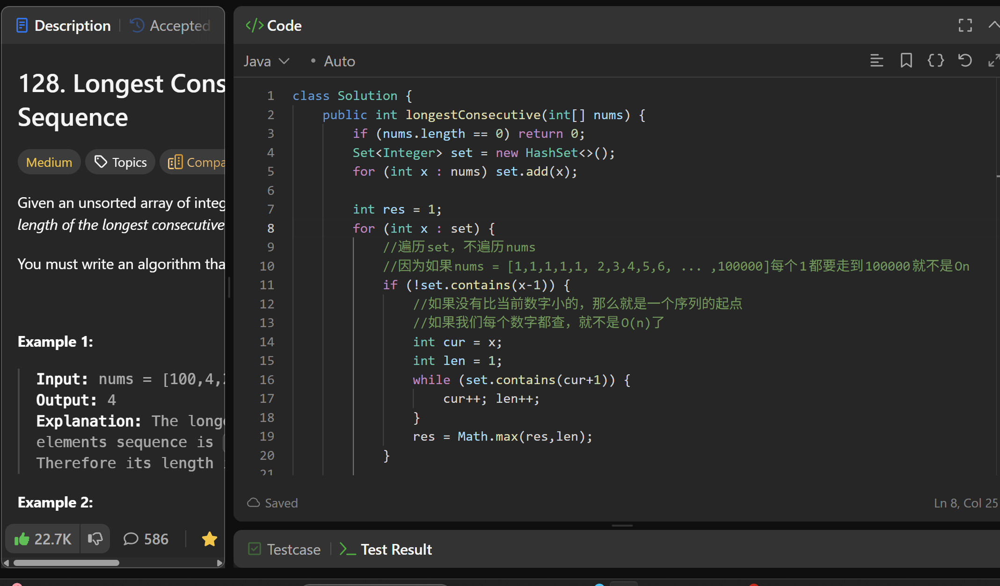

# 128. Longest Consecutive Sequence

**刷题日期**: 2026-02-20

**难度**: Medium

**标签**: Array, Hash Table, Union Find

## 题目截图



## 解题心得

- 遍历 set，不遍历 nums，因为如果 nums = [1,1,1,1,1, 2,3,4,5,6, ..., 100000]，每个 1 都要走到 100000 就不是 O(n)
- 如果没有比当前数字小的（`!set.contains(x-1)`），那么就是一个序列的起点
- 如果我们每个数字都查，就不是 O(n) 了，所以只从起点开始往后查

## 代码

```java
class Solution {
    public int longestConsecutive(int[] nums) {
        if (nums.length == 0) return 0;
        Set<Integer> set = new HashSet<>();
        for (int x : nums) set.add(x);

        int res = 1;
        for (int x : set) {
            //遍历set，不遍历nums
            //因为如果nums = [1,1,1,1,1, 2,3,4,5,6, ... ,100000]每个1都要走到100000就不是On
            if (!set.contains(x-1)) {
                //如果没有比当前数字小的，那么就是一个序列的起点
                //如果我们每个数字都查，就不是O(n)了
                int cur = x;
                int len = 1;
                while (set.contains(cur+1)) {
                    cur++; len++;
                }
                res = Math.max(res,len);
            }
        }
        return res;
    }
}
```

## 复杂度分析

- **时间复杂度**: O(n) - 虽然有嵌套循环，但每个元素最多被访问两次（外层循环一次，while 循环一次），因为只有序列起点才会进入 while 循环
- **空间复杂度**: O(n) - HashSet 存储所有元素

---
