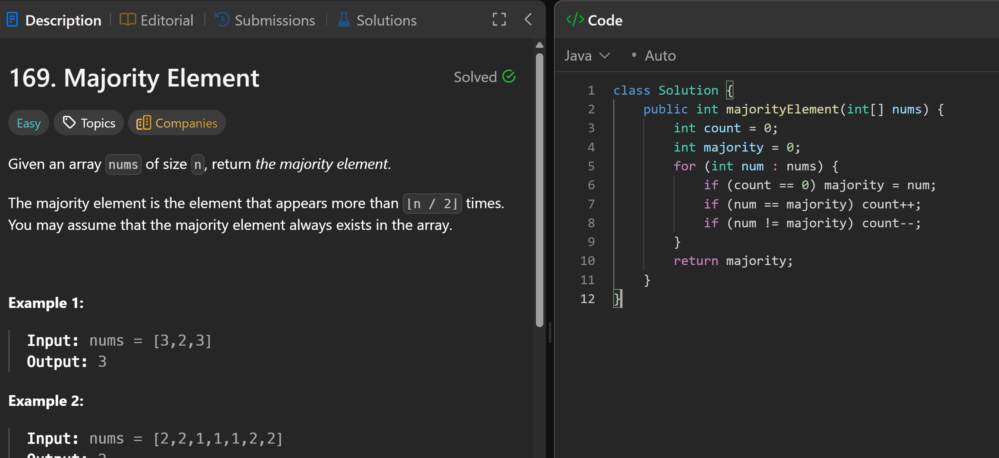

# 169. Majority Element

**刷题日期**: 2026-02-21

**难度**: Easy

**标签**: Array, Hash Table, Divide and Conquer, Sorting, Counting

## 题目截图



## 代码

```java
class Solution {
    public int majorityElement(int[] nums) {
        int count = 0;
        int majority = 0;
        for (int num : nums) {
            if (count == 0) majority = num;
            if (num == majority) count++;
            if (num != majority) count--;
        }
        return majority;
    }
}
```

## 复杂度分析

- **时间复杂度**: O(n) - 只需遍历数组一次
- **空间复杂度**: O(1) - 只使用了常数额外空间（Boyer-Moore 投票算法）

---
