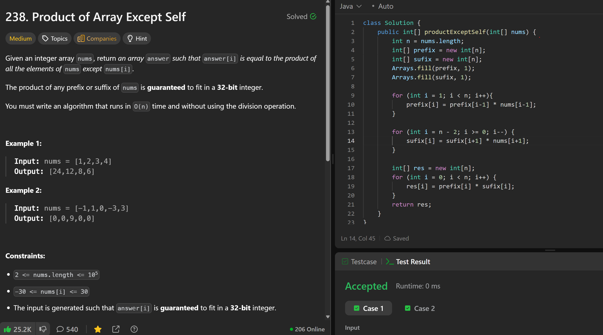

# 238. Product of Array Except Self

**刷题日期**: 2025-12-06

**难度**: Medium

**标签**: Array, Prefix Sum

## 题目截图



## 代码

```java
class Solution {
    public int[] productExceptSelf(int[] nums) {
        int n = nums.length;
        int[] prefix = new int[n];
        int[] sufix = new int[n];
        Arrays.fill(prefix, 1);
        Arrays.fill(sufix, 1);

        for (int i = 1; i < n; i++){
            prefix[i] = prefix[i-1] * nums[i-1];
        }

        for (int i = n - 2; i >= 0; i--) {
            sufix[i] = sufix[i+1] * nums[i+1];
        }

        int[] res = new int[n];
        for (int i = 0; i < n; i++) {
            res[i] = prefix[i] * sufix[i];
        }
        return res;
    }
}
```

## 复杂度分析

- **时间复杂度**: O(n) - 三次遍历数组，每次都是 O(n)
- **空间复杂度**: O(n) - 使用了 prefix 和 sufix 两个额外数组

---
