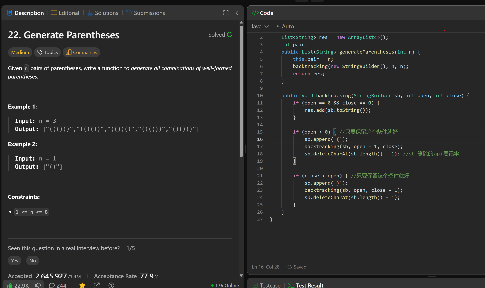

# 22. Generate Parentheses

**刷题日期**: 2025-11-23

**难度**: Medium

**标签**: String, Backtracking

## 题目截图



## 解题心得

- 回溯的条件只要保留 `open > 0` 和 `close > open` 就好
- StringBuilder 删除字符的 API 要记牢：`sb.deleteCharAt(sb.length() - 1)`

## 代码

```java
class Solution {
    List<String> res = new ArrayList<>();
    int pair;

    public List<String> generateParenthesis(int n) {
        this.pair = n;
        backtracking(new StringBuilder(), n, n);
        return res;
    }

    public void backtracking(StringBuilder sb, int open, int close) {
        if (open == 0 && close == 0) {
            res.add(sb.toString());
        }

        if (open > 0) { //只要保留这个条件就好
            sb.append('(');
            backtracking(sb, open - 1, close);
            sb.deleteCharAt(sb.length() - 1); //sb 删除的api要记牢
        }

        if (close > open) { //只要保留这个条件就好
            sb.append(')');
            backtracking(sb, open, close - 1);
            sb.deleteCharAt(sb.length() - 1);
        }
    }
}
```

## 复杂度分析

- **时间复杂度**: O(4^n / √n) - 第 n 个卡特兰数的渐近复杂度
- **空间复杂度**: O(n) - 递归栈的深度为 2n，StringBuilder 最大长度为 2n

---
