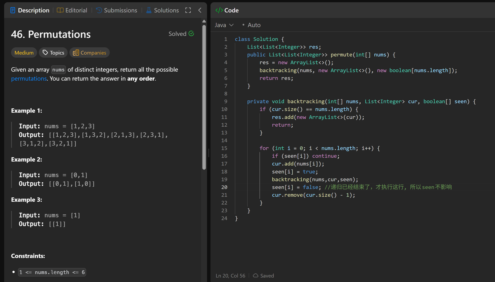

# 46. Permutations

**刷题日期**: 2025-12-07, 2026-02-28

**复习次数**: 2

**难度**: Medium

**标签**: Array, Backtracking

## 题目截图




## 解题心得

- 副本！！又忘记了：`res.add(new ArrayList<>(list));`
- 撤销！！又忘记了：`list.remove(list.size() - 1);`
- 用 boolean[] used 数组记录哪些元素已经使用过
- 递归已经结束了，才执行 seen[i] = false 这行，所以 seen 不影响

## 代码

```java
class Solution {
    private List<List<Integer>> res = new ArrayList<>();
    private int[] nums;

    public List<List<Integer>> permute(int[] nums) {
        this.nums = nums;
        backtracking(new ArrayList<>(), new boolean[21]);
        return res;
    }

    private void backtracking(List<Integer> list, boolean[] used) {
        if (list.size() == nums.length) {
            res.add(new ArrayList<>(list)); // 副本！！又忘记了
            return;
        }
        for (int i = 0; i < nums.length; i++) {
            if (used[i]) continue;
            used[i] = true;
            list.add(nums[i]);
            backtracking(list, used);
            used[i] = false;
            list.remove(list.size() - 1); // 撤销！！又忘记了
        }
    }
}
```

## 复杂度分析

- **时间复杂度**: O(n! * n) - n! 个排列，每个排列需要 O(n) 时间复制
- **空间复杂度**: O(n) - 递归栈深度和 used 数组

---
