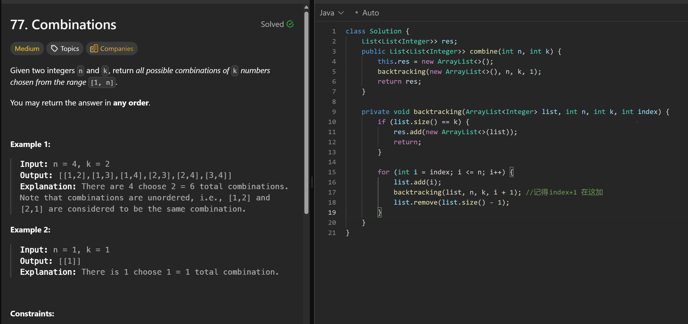

# 77. Combinations

**刷题日期**: 2025-12-07

**难度**: Medium

**标签**: Backtracking

## 题目截图



## 解题心得

- 记得 index+1 在这加：`backtracking(list, n, k, i + 1);`
- 组合问题需要用 index 避免重复，从当前位置的下一个开始选

## 代码

```java
class Solution {
    List<List<Integer>> res;

    public List<List<Integer>> combine(int n, int k) {
        this.res = new ArrayList<>();
        backtracking(new ArrayList<>(), n, k, 1);
        return res;
    }

    private void backtracking(ArrayList<Integer> list, int n, int k, int index) {
        if (list.size() == k) {
            res.add(new ArrayList<>(list));
            return;
        }

        for (int i = index; i <= n; i++) {
            list.add(i);
            backtracking(list, n, k, i + 1); //记得index+1 在这加
            list.remove(list.size() - 1);
        }
    }
}
```

## 复杂度分析

- **时间复杂度**: O(C(n,k) * k) - C(n,k) 个组合，每个组合需要 O(k) 时间复制
- **空间复杂度**: O(k) - 递归栈深度

---
