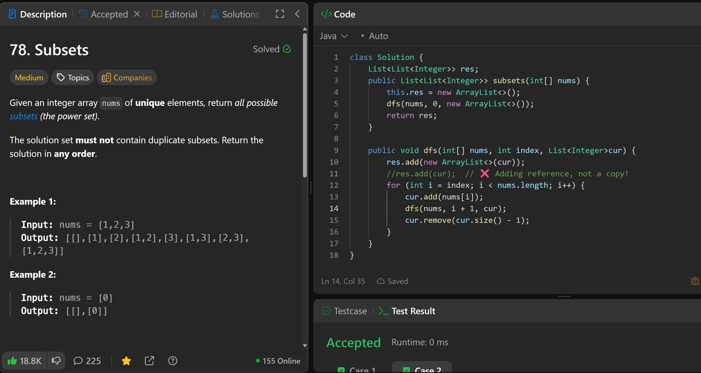

# 78. Subsets

**刷题日期**: 2025-11-21

**难度**: Medium

**标签**: Array, Backtracking, Bit Manipulation

## 题目截图



## 解题心得

注意不能直接 `res.add(cur)`，这样添加的是引用而不是副本！必须用 `res.add(new ArrayList<>(cur))` 创建新的 ArrayList。

## 代码

```java
class Solution {
    List<List<Integer>> res;
    public List<List<Integer>> subsets(int[] nums) {
        this.res = new ArrayList<>();
        dfs(nums, 0, new ArrayList<>());
        return res;
    }

    public void dfs(int[] nums, int index, List<Integer>cur) {
        res.add(new ArrayList<>(cur));
        //res.add(cur); // ❌ Adding reference, not a copy!
        for (int i = index; i < nums.length; i++) {
            cur.add(nums[i]);
            dfs(nums, i + 1, cur);
            cur.remove(cur.size() - 1);
        }
    }
}
```

## 复杂度分析

- **时间复杂度**: O(n × 2^n) - 共有 2^n 个子集，每个子集平均需要 O(n) 时间来复制
- **空间复杂度**: O(n) - 递归调用栈的深度为 n，不计算存储结果的空间

---
