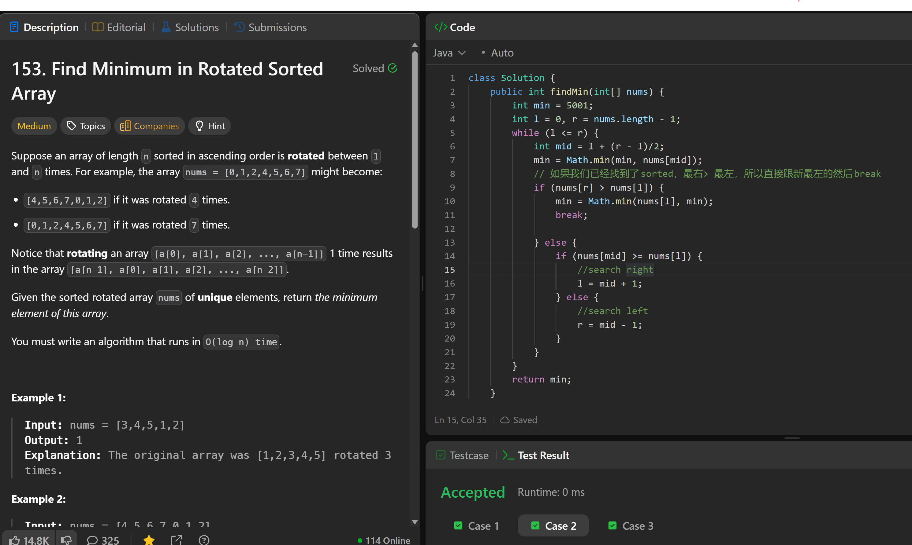

# 153. Find Minimum in Rotated Sorted Array

**刷题日期**: 2025-12-07

**难度**: Medium

**标签**: Array, Binary Search

## 题目截图



## 解题心得

如果我们已经找到了 sorted 的部分（最右 > 最左），所以直接跟新最左的然后 break。

## 代码

```java
class Solution {
    public int findMin(int[] nums) {
        int min = 5001;
        int l = 0, r = nums.length - 1;
        while (l <= r) {
            int mid = l + (r - l)/2;
            min = Math.min(min, nums[mid]);
            // 如果我们已经找到了sorted, 最右> 最左, 所以直接跟新最左的然后break
            if (nums[r] > nums[l]) {
                min = Math.min(nums[l], min);
                break;
            } else {
                if (nums[mid] >= nums[l]) {
                    //search right
                    l = mid + 1;
                } else {
                    //search left
                    r = mid - 1;
                }
            }
        }
        return min;
    }
}
```

## 复杂度分析

- **时间复杂度**: O(log n) - 二分搜索，每次将搜索范围缩小一半
- **空间复杂度**: O(1) - 只使用常数额外空间

---
