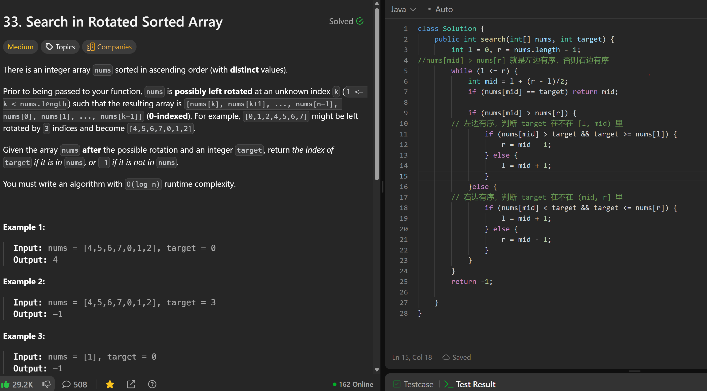

# 33. Search in Rotated Sorted Array

**刷题日期**: 2025-12-06, 2025-12-07

**复习次数**: 2

**难度**: Medium

**标签**: Array, Binary Search

## 题目截图



## 解题心得

- `nums[mid] > nums[r]` 就是左边有序，否则右边有序
- 左边有序，判断 target 在不在 [l, mid) 里
- 右边有序，判断 target 在不在 (mid, r] 里

**2025-12-07 复习心得**:
- sorted 在左：`nums[mid] > target && nums[l] <= target` 时搜左边
- sorted 在右：`nums[mid] < target && nums[r] >= target` 时搜右边

## 代码

```java
class Solution {
    public int search(int[] nums, int target) {
        int l = 0, r = nums.length - 1;
        //nums[mid] > nums[r] 就是左边有序, 否则右边有序
        while (l <= r) {
            int mid = l + (r - l)/2;
            if (nums[mid] == target) return mid;

            if (nums[mid] > nums[r]) {
                // 左边有序, 判断 target 在不在 [l, mid) 里
                if (nums[mid] > target && target >= nums[l]) {
                    r = mid - 1;
                } else {
                    l = mid + 1;
                }
            } else {
                // 右边有序, 判断 target 在不在 (mid, r] 里
                if (nums[mid] < target && target <= nums[r]) {
                    l = mid + 1;
                } else {
                    r = mid - 1;
                }
            }
        }
        return -1;
    }
}
```

## 复杂度分析

- **时间复杂度**: O(log n) - 二分查找
- **空间复杂度**: O(1) - 只使用了常数个变量

---
