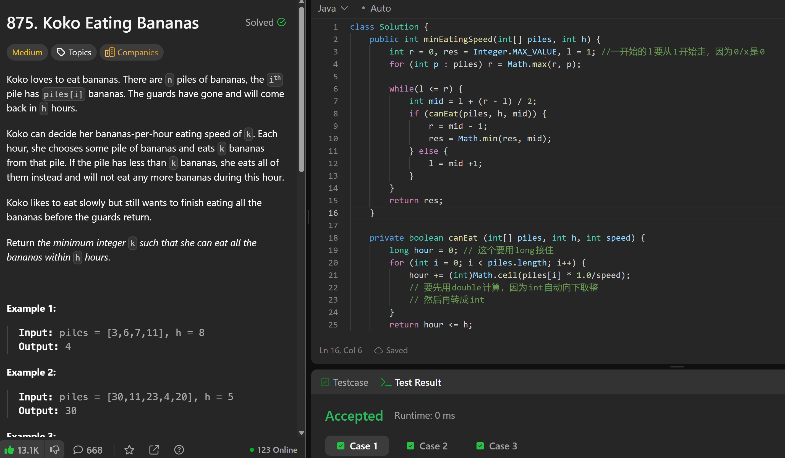

# 875. Koko Eating Bananas

**刷题日期**: 2025-12-11, 2026-02-22

**复习次数**: 2

**难度**: Medium

**标签**: Binary Search

## 题目截图



## 解题心得

- 一开始的 `l` 要从 1 开始走，因为 `0/x` 是 0
- `hour` 变量要用 `long` 接住，防止溢出（记得是 long，如果是最坏的情况，会溢出）
- 计算每堆香蕉需要的时间时，要先用 `double` 计算（`piles[i] * 1.0/speed`），因为 `int` 自动向下取整，然后再用 `Math.ceil()` 向上取整转成 `int`

## 代码

```java
class Solution {
    public int minEatingSpeed(int[] piles, int h) {
        int r = 0, res = Integer.MAX_VALUE, l = 1; //一开始的l要从1开始走，因为0/x是0
        for (int p : piles) r = Math.max(r, p);

        while(l <= r) {
            int mid = l + (r - l) / 2;
            if (canEat(piles, h, mid)) {
                r = mid - 1;
                res = Math.min(res, mid);
            } else {
                l = mid +1;
            }
        }
        return res;
    }

    private boolean canEat (int[] piles, int h, int speed) {
        long hour = 0; // 这个要用long接住
        for (int i = 0; i < piles.length; i++) {
            hour += (int)Math.ceil(piles[i] * 1.0/speed);
            // 要先用double计算，因为int自动向下取整
            // 然后再转成int
        }
        return hour <= h;
    }
}
```

## 复杂度分析

- **时间复杂度**: O(n log m) - 其中 n 是 piles 数组的长度，m 是 piles 中的最大值。二分搜索需要 O(log m) 次迭代，每次迭代需要 O(n) 时间来计算能否在给定速度下吃完所有香蕉
- **空间复杂度**: O(1) - 只使用了常数级别的额外空间

---
