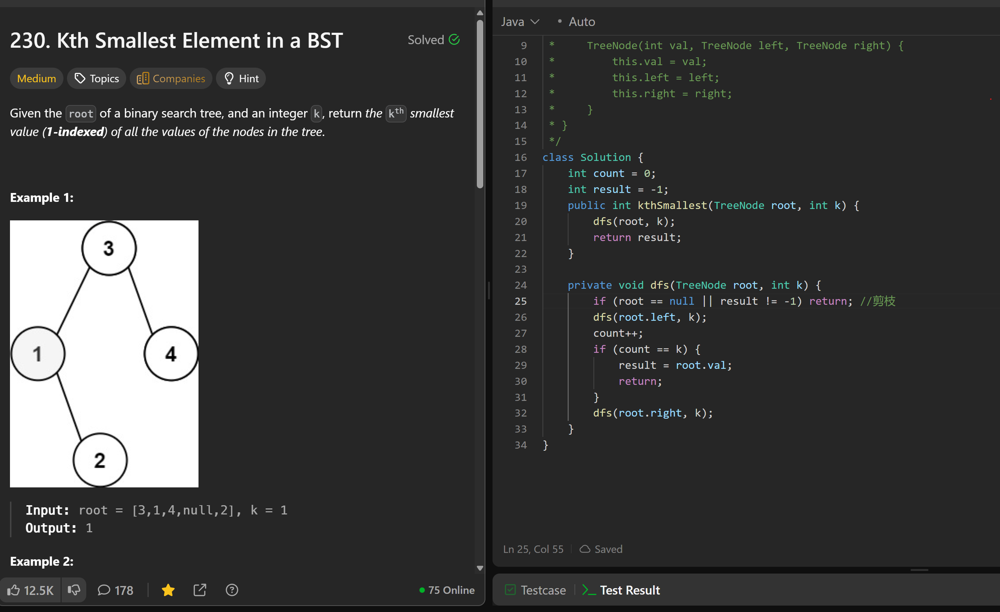

# 230. Kth Smallest Element in a BST

**刷题日期**: 2025-12-07

**难度**: Medium

**标签**: Tree, Depth-First Search, Binary Search Tree, Binary Tree

## 题目截图



## 解题心得

- 利用 BST 的中序遍历是有序的特性
- 剪枝：`if (root == null || result != -1) return;` 找到结果后提前返回
- 中序遍历：先左子树 → count++ → 判断是否第 k 个 → 再右子树

## 代码

```java
class Solution {
    int count = 0;
    int result = -1;
    public int kthSmallest(TreeNode root, int k) {
        dfs(root, k);
        return result;
    }

    private void dfs(TreeNode root, int k) {
        if (root == null || result != -1) return; //剪枝
        dfs(root.left, k);
        count++;
        if (count == k) {
            result = root.val;
            return;
        }
        dfs(root.right, k);
    }
}
```

## 复杂度分析

- **时间复杂度**: O(H + k) - H 是树的高度，最坏情况下需要遍历 k 个节点
- **空间复杂度**: O(H) - 递归调用栈的深度

---
