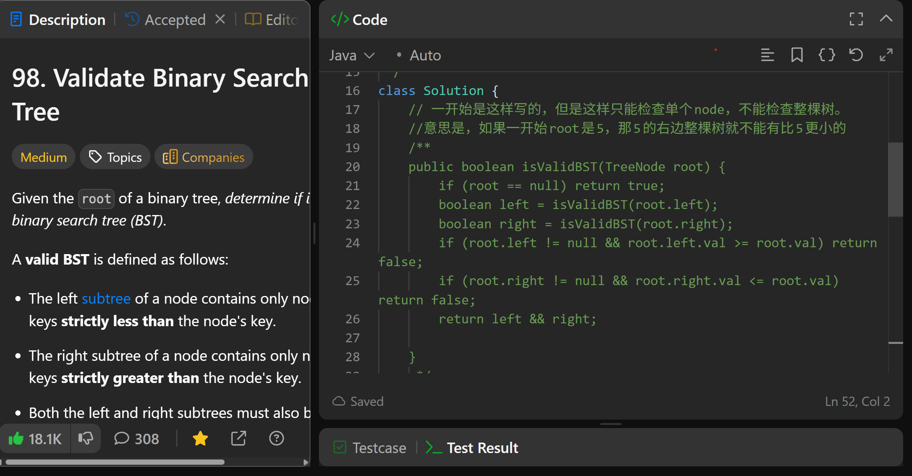
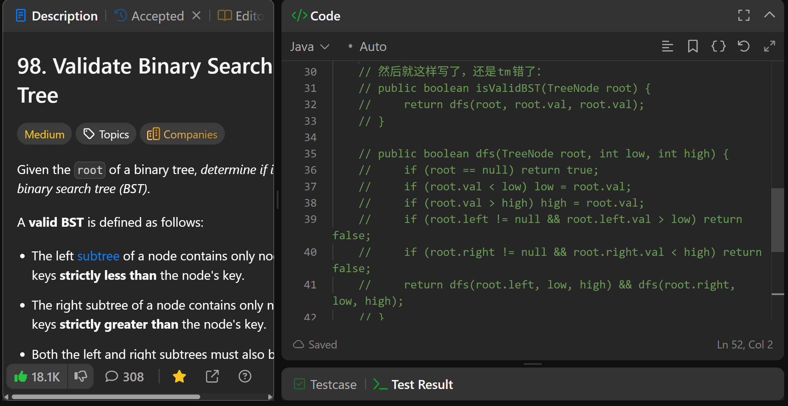
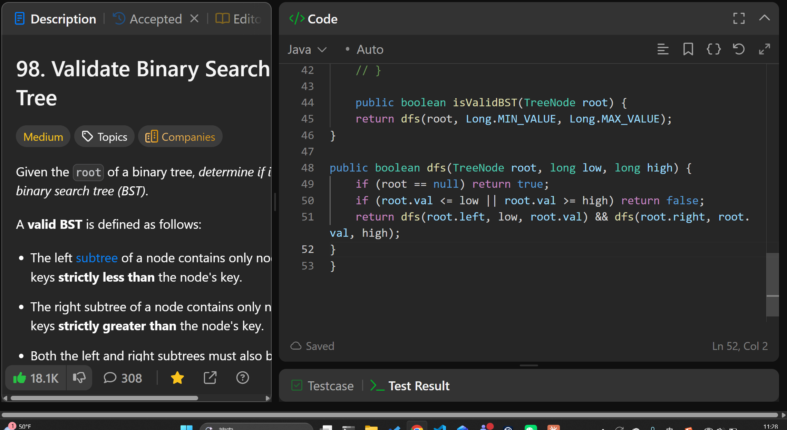

# 98. Validate Binary Search Tree

**刷题日期**: 2025-11-21, 2025-12-07, 2026-02-23

**复习次数**: 3

**难度**: Medium

**标签**: Tree, Depth-First Search, Binary Search Tree, Binary Tree

## 题目截图







## 解题心得

一开始是这样写的，但是这样只能检查单个 node，不能检查整棵树。意思是，如果一开始 root 是 5，那 5 的右边整棵树就不能有比 5 更小的。

然后就这样写了，还是错了。

最终正确解法：用 `Long.MIN_VALUE` 和 `Long.MAX_VALUE` 作为初始边界，递归时更新边界范围。

**2025-12-07 复习心得**:
- 要用 long，因为 root = [2147483647] 只有一个 node 时会报错，这个就是最大的 integer
- 左子树：所有值必须 < root.val → 更新上界 max 为 root.val
- 右子树：所有值必须 > root.val → 更新下界 min 为 root.val

**2026-02-23 复习心得**:
- root 没有限制，因为 root 可以是任何数字
- 要用 long，因为 root 很有可能是最边界的数字
- 如果是 left，把上界收紧，left 的每一个 node 都要小于等于父值
- 如果是 right，把下界收紧，right 的每一个 node 都要大于等于父值

## 代码

```java
class Solution {
    public boolean isValidBST(TreeNode root) {
        return dfs(root, Long.MIN_VALUE, Long.MAX_VALUE);
    }

    public boolean dfs(TreeNode root, long low, long high) {
        if (root == null) return true;
        if (root.val <= low || root.val >= high) return false;
        return dfs(root.left, low, root.val) && dfs(root.right, root.val, high);
    }
}
```

## 复杂度分析

- **时间复杂度**: O(n) - n 是二叉树的节点数，每个节点访问一次
- **空间复杂度**: O(h) - h 是树的高度，递归调用栈的深度，最坏情况下为 O(n)

---
