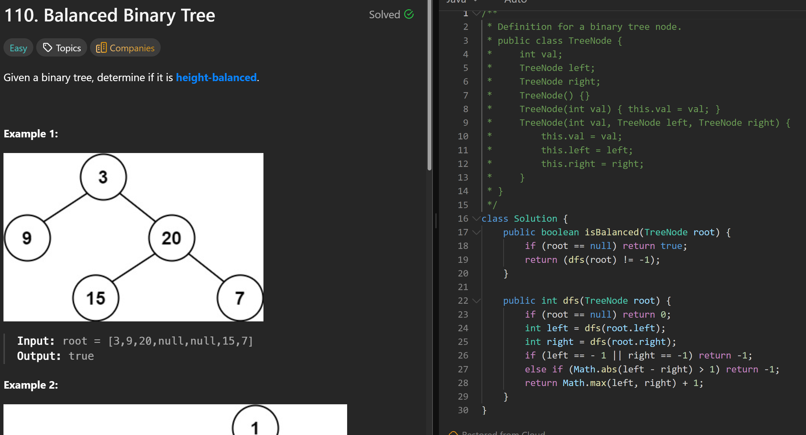

# 110. Balanced Binary Tree

**刷题日期**: 2025-11-20

**难度**: Easy

**标签**: Tree, Depth-First Search, Binary Tree

## 题目截图



## 代码

```java
class Solution {
    public boolean isBalanced(TreeNode root) {
        if (root == null) return true;
        return (dfs(root) != -1);
    }

    public int dfs(TreeNode root) {
        if (root == null) return 0;
        int left = dfs(root.left);
        int right = dfs(root.right);
        if (left == -1 || right == -1) return -1;
        else if (Math.abs(left - right) > 1) return -1;
        return Math.max(left, right) + 1;
    }
}
```

## 复杂度分析

- **时间复杂度**: O(n) - n 是二叉树的节点数，每个节点最多访问一次
- **空间复杂度**: O(h) - h 是树的高度，递归调用栈的深度，最坏情况下为 O(n)

---
