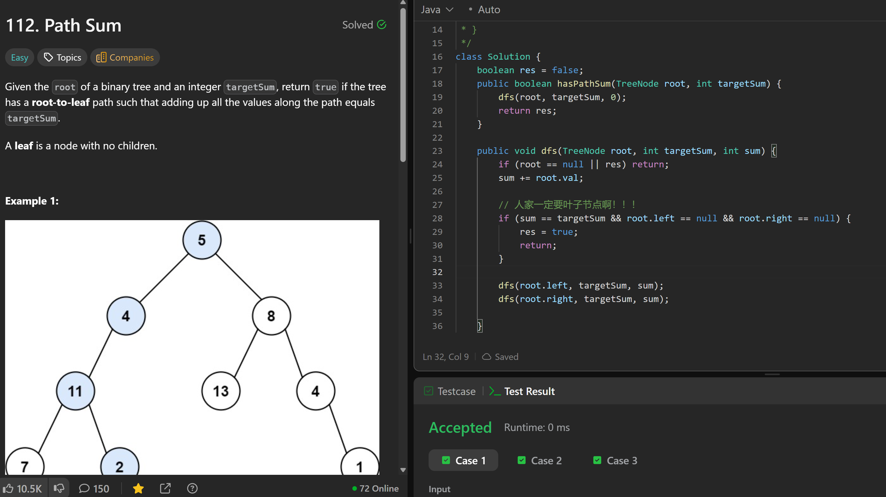

# 112. Path Sum

**刷题日期**: 2025-12-06

**难度**: Easy

**标签**: Tree, Depth-First Search, Binary Tree

## 题目截图



## 解题心得

- 人家一定要叶子节点啊！！！
- 判断条件必须是 `root.left == null && root.right == null`

## 代码

```java
class Solution {
    boolean res = false;
    public boolean hasPathSum(TreeNode root, int targetSum) {
        dfs(root, targetSum, 0);
        return res;
    }

    public void dfs(TreeNode root, int targetSum, int sum) {
        if (root == null || res) return;
        sum += root.val;

        // 人家一定要叶子节点啊！！！
        if (sum == targetSum && root.left == null && root.right == null) {
            res = true;
            return;
        }

        dfs(root.left, targetSum, sum);
        dfs(root.right, targetSum, sum);
    }
}
```

## 复杂度分析

- **时间复杂度**: O(n) - n 是二叉树的节点数，每个节点访问一次
- **空间复杂度**: O(h) - h 是树的高度，递归调用栈的深度，最坏情况下为 O(n)

---
