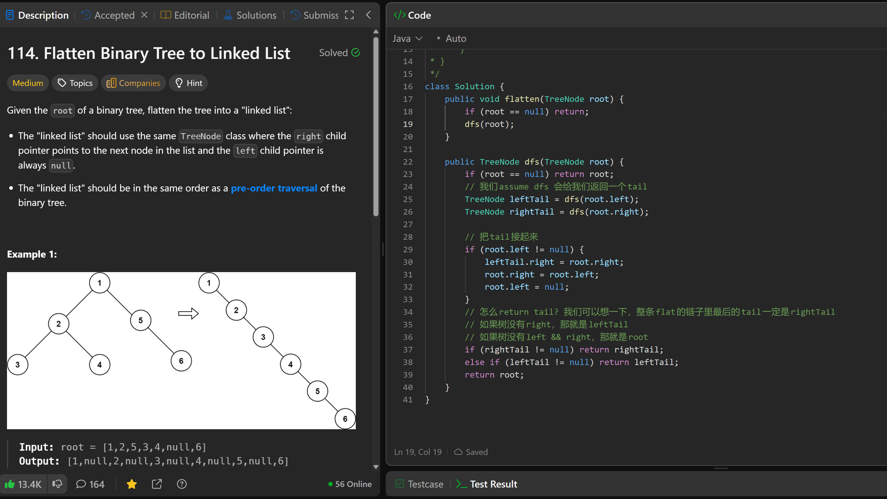

# 114. Flatten Binary Tree to Linked List

**刷题日期**: 2025-12-06

**难度**: Medium

**标签**: Tree, Depth-First Search, Binary Tree, Linked List

## 题目截图



## 解题心得

- 我们 assume dfs 会给我们返回一个 tail
- 把 tail 接起来
- 怎么 return tail？我们可以想一下，整条 flat 的链子里最后的 tail 一定是 rightTail
- 如果树没有 right，那就是 leftTail
- 如果树没有 left && right，那就是 root

## 代码

```java
class Solution {
    public void flatten(TreeNode root) {
        if (root == null) return;
        dfs(root);
    }

    public TreeNode dfs(TreeNode root) {
        if (root == null) return root;
        // 我们assume dfs 会给我们返回一个tail
        TreeNode leftTail = dfs(root.left);
        TreeNode rightTail = dfs(root.right);

        // 把tail接起来
        if (root.left != null) {
            leftTail.right = root.right;
            root.right = root.left;
            root.left = null;
        }
        // 怎么return tail? 我们可以想一下, 整条flat的链子里最后的tail一定是rightTail
        // 如果树没有right, 那就是leftTail
        // 如果树没有left && right, 那就是root
        if (rightTail != null) return rightTail;
        else if (leftTail != null) return leftTail;
        return root;
    }
}
```

## 复杂度分析

- **时间复杂度**: O(n) - n 是二叉树的节点数，每个节点访问一次
- **空间复杂度**: O(h) - h 是树的高度，递归调用栈的深度，最坏情况下为 O(n)

---
