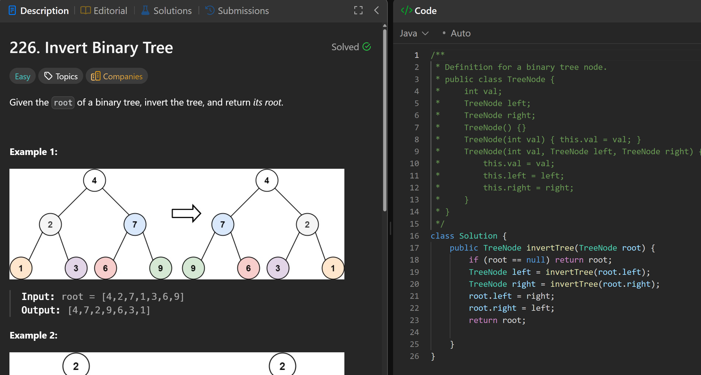

# 226. Invert Binary Tree

**刷题日期**: 2025-11-20, 2025-12-06

**复习次数**: 2

**难度**: Easy

**标签**: Tree, Depth-First Search, Breadth-First Search, Binary Tree

## 题目截图



## 代码

```java
class Solution {
    public TreeNode invertTree(TreeNode root) {
        if (root == null) return root;
        TreeNode left = invertTree(root.left);
        TreeNode right = invertTree(root.right);
        root.left = right;
        root.right = left;
        return root;
    }
}
```

## 复杂度分析

- **时间复杂度**: O(n) - n 是二叉树的节点数，每个节点访问一次
- **空间复杂度**: O(h) - h 是树的高度，递归调用栈的深度，最坏情况下为 O(n)

---
