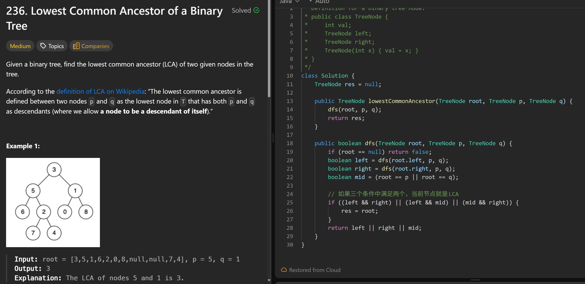

# 236. Lowest Common Ancestor of a Binary Tree

**刷题日期**: 2025-11-20

**难度**: Medium

**标签**: Tree, Depth-First Search, Binary Tree

## 题目截图



## 解题心得

如果三个条件中满足两个，当前节点就是 LCA

## 代码

```java
class Solution {
    TreeNode res = null;

    public TreeNode lowestCommonAncestor(TreeNode root, TreeNode p, TreeNode q) {
        dfs(root, p, q);
        return res;
    }

    public boolean dfs(TreeNode root, TreeNode p, TreeNode q) {
        if (root == null) return false;
        boolean left = dfs(root.left, p, q);
        boolean right = dfs(root.right, p, q);
        boolean mid = (root == p || root == q);

        // 如果三个条件中满足两个，当前节点就是 LCA
        if ((left && right) || (left && mid) || (mid && right)) {
            res = root;
        }
        return left || right || mid;
    }
}
```

## 复杂度分析

- **时间复杂度**: O(n) - n 是二叉树的节点数，每个节点访问一次
- **空间复杂度**: O(h) - h 是树的高度，递归调用栈的深度，最坏情况下为 O(n)

---
