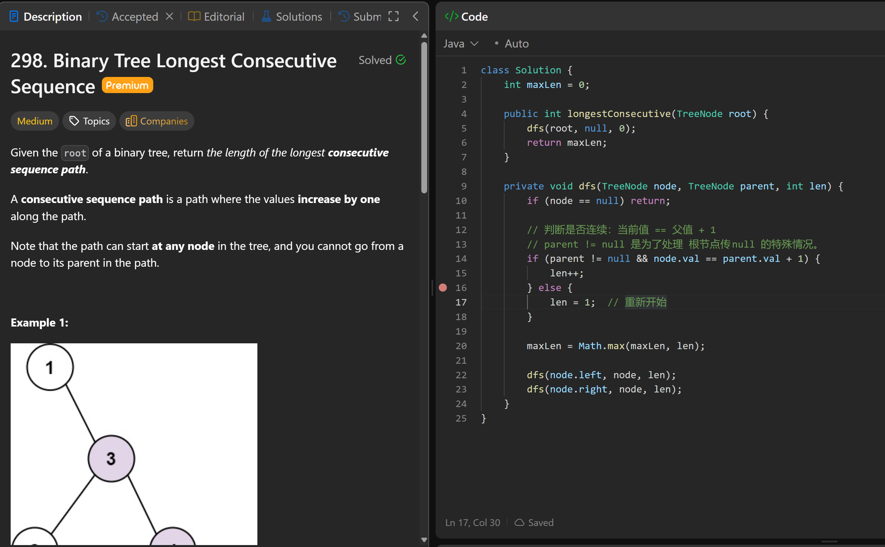

# 298. Binary Tree Longest Consecutive Sequence

**刷题日期**: 2025-11-27

**难度**: Medium

**标签**: Binary Tree, DFS, Tree

## 题目截图



## 解题心得

- 判断是否连续：当前值 == 父值 + 1
- 若 parent != null 是为了处理根节点null的特殊情况
- 当不连续时，重新开始计数（len = 1）

## 代码

```java
class Solution {
    int maxLen = 0;

    public int longestConsecutive(TreeNode root) {
        dfs(root, null, 0);
        return maxLen;
    }

    private void dfs(TreeNode node, TreeNode parent, int len) {
        if (node == null) return;

        // 判断是否连续：当前值 == 父值 + 1
        // 若 parent != null 是为了处理根节点null的特殊情况。
        if (parent != null && node.val == parent.val + 1) {
            len++;
        } else {
            len = 1;  // 重新开始
        }

        maxLen = Math.max(maxLen, len);

        dfs(node.left, node, len);
        dfs(node.right, node, len);
    }
}
```

## 复杂度分析

- **时间复杂度**: O(n) - n 是二叉树节点的数量，每个节点访问一次
- **空间复杂度**: O(h) - h 是树的高度，递归调用栈的空间，最坏情况下 O(n)（完全不平衡树）
