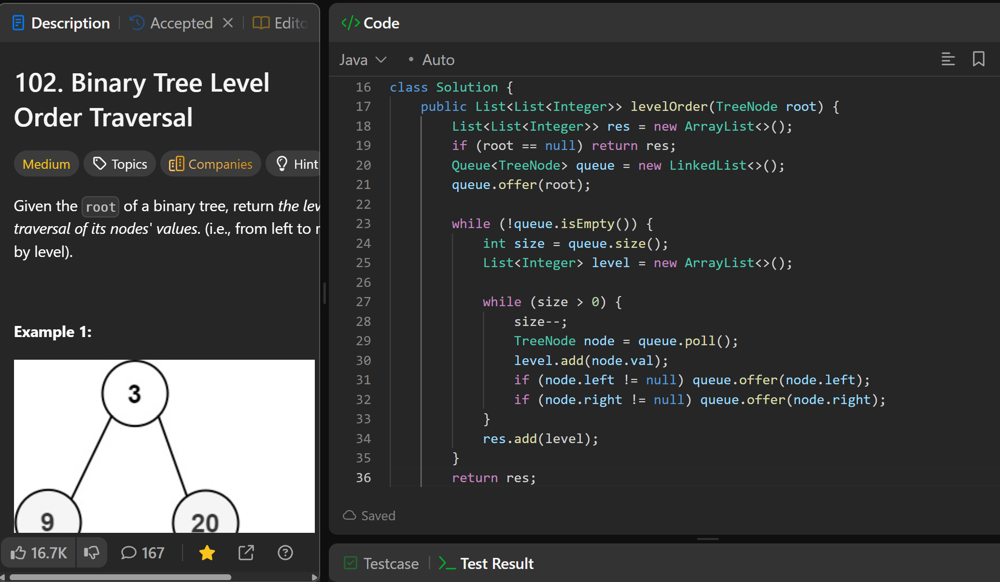

# 102. Binary Tree Level Order Traversal

**刷题日期**: 2025-11-21

**难度**: Medium

**标签**: Tree, Breadth-First Search, Binary Tree

## 题目截图



## 代码

```java
class Solution {
    public List<List<Integer>> levelOrder(TreeNode root) {
        List<List<Integer>> res = new ArrayList<>();
        if (root == null) return res;
        Queue<TreeNode> queue = new LinkedList<>();
        queue.offer(root);

        while (!queue.isEmpty()) {
            int size = queue.size();
            List<Integer> level = new ArrayList<>();

            while (size > 0) {
                size--;
                TreeNode node = queue.poll();
                level.add(node.val);
                if (node.left != null) queue.offer(node.left);
                if (node.right != null) queue.offer(node.right);
            }
            res.add(level);
        }
        return res;
    }
}
```

## 复杂度分析

- **时间复杂度**: O(n) - n 是二叉树的节点数，每个节点访问一次
- **空间复杂度**: O(n) - 最坏情况下队列中可能包含 n/2 个节点（最后一层）

---
