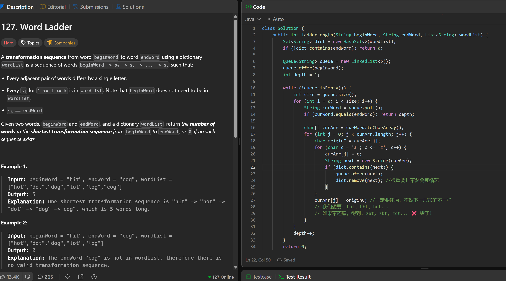

# 127. Word Ladder

**刷题日期**: 2026-02-22

**难度**: Hard

**标签**: Hash Table, String, Breadth-First Search

## 题目截图



## 解题心得

- 一定要还原，不然下一层遍历的不一样
- 加完要 `dict.remove(next)`，很重要！不然会死循环
- 如果不还原，例如 hat, hbt, hct... 错了！

## 代码

```java
class Solution {
    public int ladderLength(String beginWord, String endWord, List<String> wordList) {
        Set<String> dict = new HashSet<>(wordList);
        if (!dict.contains(endWord)) return 0;

        Queue<String> queue = new LinkedList<>();
        queue.offer(beginWord);
        int depth = 1;

        while (!queue.isEmpty()) {
            int size = queue.size();
            for (int i = 0; i < size; i++) {
                String curWord = queue.poll();
                if (curWord.equals(endWord)) return depth;

                char[] curArr = curWord.toCharArray();
                for (int j = 0; j < curArr.length; j++) {
                    char originC = curArr[j];
                    for (char c = 'a'; c <= 'z'; c++) {
                        curArr[j] = c;
                        String next = new String(curArr);
                        if (dict.contains(next)) {
                            queue.offer(next);
                            dict.remove(next); // 很重要！不然会死循环
                        }
                    }
                    curArr[j] = originC; // 一定要还原，不然下一层遍历的不一样
                }
            }
            depth++;
        }
        return 0;
    }
}
```

## 复杂度分析

- **时间复杂度**: O(M² * N) - M 是单词长度，N 是词典大小，每个单词需要尝试 M 个位置 × 26 个字母，每次生成新字符串 O(M)
- **空间复杂度**: O(M * N) - 队列和字典的存储空间

---
