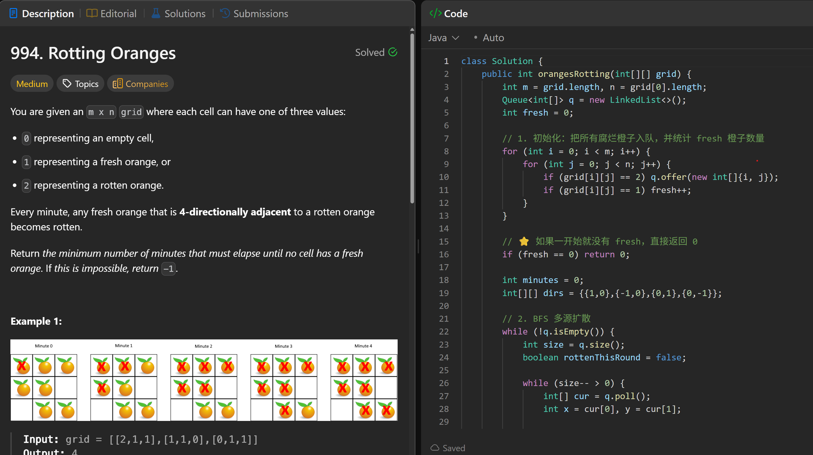
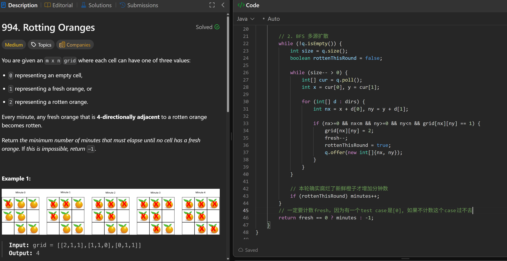

# 994. Rotting Oranges

**刷题日期**: 2025-11-20

**难度**: Medium

**标签**: Array, Breadth-First Search, Matrix

## 题目截图





## 解题心得

1. 初始化：把所有腐烂橙子入队，并统计 fresh 橙子数量
2. BFS 多源扩散
3. 一定要计数 fresh，因为有一个 test case 是 [0]，如果不计数这个 case 过不去

## 代码

```java
class Solution {
    public int orangesRotting(int[][] grid) {
        int m = grid.length, n = grid[0].length;
        Queue<int[]> q = new LinkedList<>();
        int fresh = 0;

        // 1. 初始化：把所有腐烂橙子入队，并统计 fresh 橙子数量
        for (int i = 0; i < m; i++) {
            for (int j = 0; j < n; j++) {
                if (grid[i][j] == 2) q.offer(new int[]{i, j});
                if (grid[i][j] == 1) fresh++;
            }
        }

        // 如果一开始就没有 fresh，直接返回 0
        if (fresh == 0) return 0;

        int minutes = 0;
        int[][] dirs = {{1,0},{-1,0},{0,1},{0,-1}};

        // 2. BFS 多源扩散
        while (!q.isEmpty()) {
            int size = q.size();
            boolean rottenThisRound = false;

            while (size-- > 0) {
                int[] cur = q.poll();
                int x = cur[0], y = cur[1];

                for (int[] d : dirs) {
                    int nx = x + d[0], ny = y + d[1];

                    if (nx>=0 && nx<m && ny>=0 && ny<n && grid[nx][ny] == 1) {
                        grid[nx][ny] = 2;
                        fresh--;
                        rottenThisRound = true;
                        q.offer(new int[]{nx, ny});
                    }
                }
            }

            // 本轮确实腐烂了新鲜橙子才增加分钟数
            if (rottenThisRound) minutes++;
        }
        // 一定要计数 fresh，因为有一个 test case 是 [0]，如果不计数这个 case 过不去
        return fresh == 0 ? minutes : -1;
    }
}
```

## 复杂度分析

- **时间复杂度**: O(m × n) - m 和 n 分别是网格的行数和列数，每个格子最多访问一次
- **空间复杂度**: O(m × n) - 最坏情况下队列中可能包含所有格子

---
