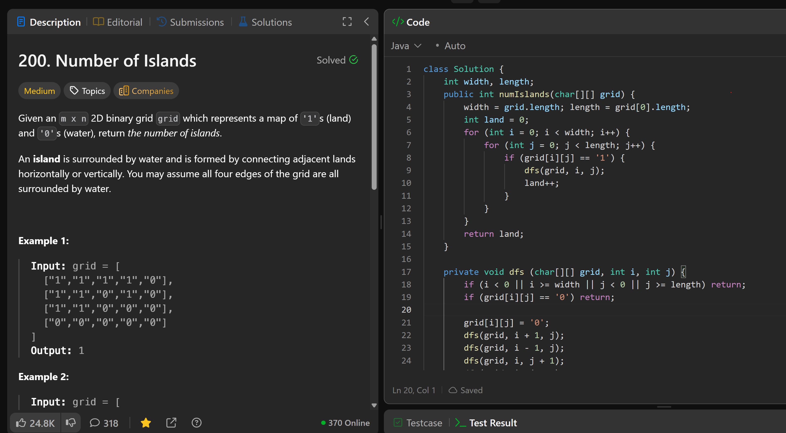

# 200. Number of Islands

**刷题日期**: 2026-02-17

**难度**: Medium

**标签**: Depth-First Search, Breadth-First Search, Union Find, Array, Matrix

## 题目截图



## 代码

```java
class Solution {
    int width, length;
    public int numIslands(char[][] grid) {
        width = grid.length; length = grid[0].length;
        int land = 0;
        for (int i = 0; i < width; i++) {
            for (int j = 0; j < length; j++) {
                if (grid[i][j] == '1') {
                    dfs(grid, i, j);
                    land++;
                }
            }
        }
        return land;
    }

    private void dfs (char[][] grid, int i, int j) {
        if (i < 0 || i >= width || j < 0 || j >= length) return;
        if (grid[i][j] == '0') return;

        grid[i][j] = '0';
        dfs(grid, i + 1, j);
        dfs(grid, i - 1, j);
        dfs(grid, i, j + 1);
        dfs(grid, i, j - 1);
    }
}
```

## 复杂度分析

- **时间复杂度**: O(m * n) - m 和 n 分别是网格的行数和列数，最坏情况下需要遍历整个网格
- **空间复杂度**: O(m * n) - 最坏情况下（全是陆地），递归调用栈的深度为 m * n
