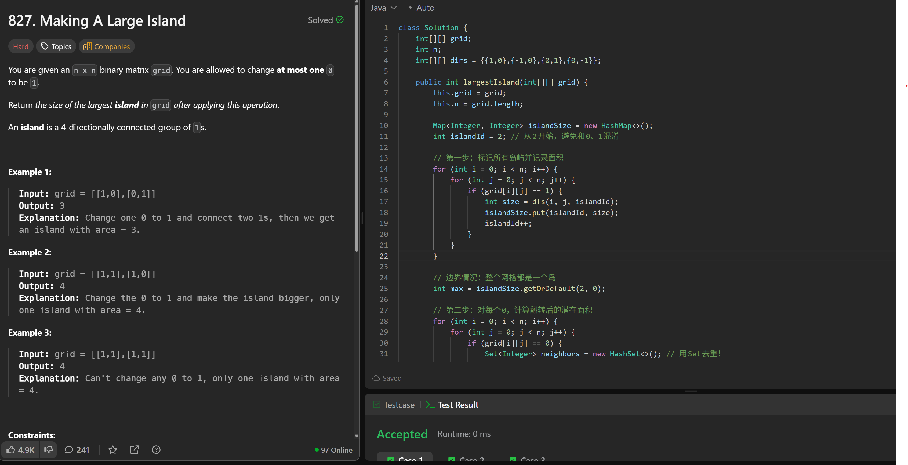
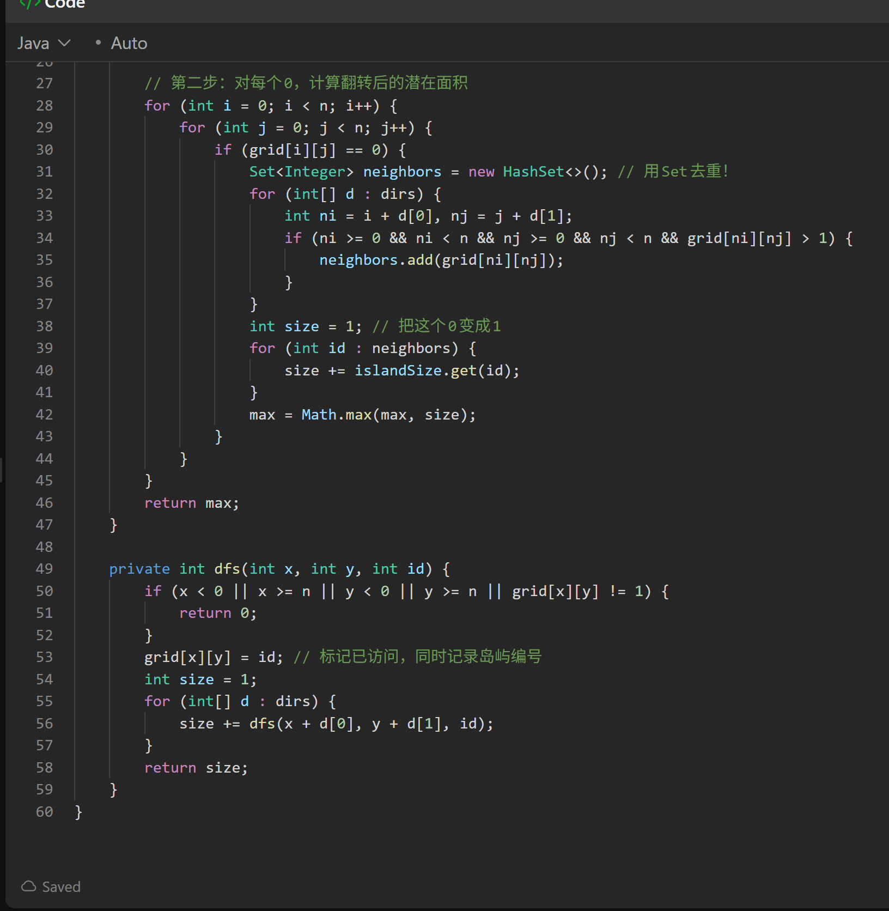

# 827. Making A Large Island

**刷题日期**: 2025-12-04

**难度**: Hard

**标签**: Depth-First Search, Breadth-First Search, Union Find, Array, Matrix

## 题目截图





## 解题心得

- 从2开始标记岛屿ID，避免和0、1混淆
- 第一步：用DFS标记所有岛屿并记录每个岛屿的面积
- 边界情况：整个网格都是一个岛时，直接返回该岛的面积
- 第二步：对每个0，计算翻转后的潜在面积
- 用Set去重！避免重复计算相邻的同一个岛屿
- 标记已访问的同时记录岛屿编号，一举两得

## 代码

```java
class Solution {
    int[][] grid;
    int n;
    int[][] dirs = {{1,0},{-1,0},{0,1},{0,-1}};

    public int largestIsland(int[][] grid) {
        this.grid = grid;
        this.n = grid.length;

        Map<Integer, Integer> islandSize = new HashMap<>();
        int islandId = 2; // 从2开始，避免和0、1混淆

        // 第一步：标记所有岛屿并记录面积
        for (int i = 0; i < n; i++) {
            for (int j = 0; j < n; j++) {
                if (grid[i][j] == 1) {
                    int size = dfs(i, j, islandId);
                    islandSize.put(islandId, size);
                    islandId++;
                }
            }
        }

        // 边界情况：整个网格都是一个岛
        int max = islandSize.getOrDefault(2, 0);

        // 第二步：对每个0，计算翻转后的潜在面积
        for (int i = 0; i < n; i++) {
            for (int j = 0; j < n; j++) {
                if (grid[i][j] == 0) {
                    Set<Integer> neighbors = new HashSet<>(); // 用Set去重！
                    for (int[] d : dirs) {
                        int ni = i + d[0], nj = j + d[1];
                        if (ni >= 0 && ni < n && nj >= 0 && nj < n && grid[ni][nj] > 1) {
                            neighbors.add(grid[ni][nj]);
                        }
                    }
                    int size = 1; // 把这个0变成1
                    for (int id : neighbors) {
                        size += islandSize.get(id);
                    }
                    max = Math.max(max, size);
                }
            }
        }

        return max;
    }

    private int dfs(int x, int y, int id) {
        if (x < 0 || x >= n || y < 0 || y >= n || grid[x][y] != 1) {
            return 0;
        }
        grid[x][y] = id; // 标记已访问，同时记录岛屿编号
        int size = 1;
        for (int[] d : dirs) {
            size += dfs(x + d[0], y + d[1], id);
        }
        return size;
    }
}
```

## 复杂度分析

- **时间复杂度**: O(n²) - 需要遍历整个网格两次，第一次标记岛屿，第二次计算翻转每个0后的最大面积
- **空间复杂度**: O(n²) - 最坏情况下递归栈的深度为 n²（整个网格是一个岛屿），以及存储岛屿面积的HashMap

---
