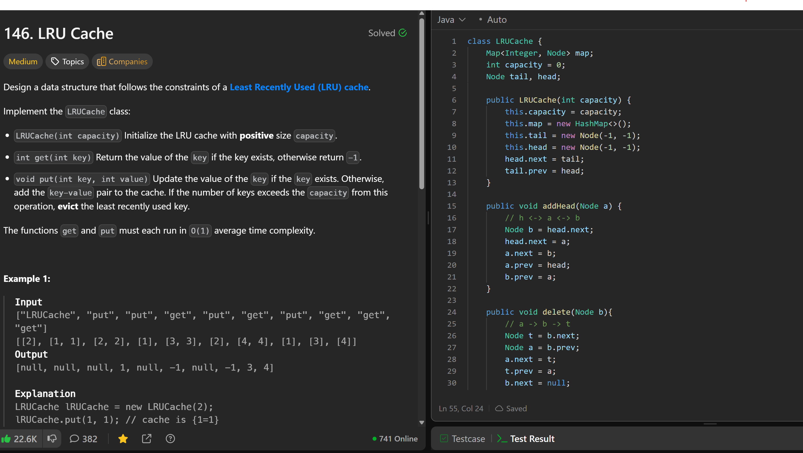

# 146. LRU Cache

**刷题日期**: 2025-12-02

**难度**: Medium

**标签**: Hash Table, Linked List, Design, Doubly-Linked List

## 题目截图



## 解题心得

- 使用 **HashMap + 双向链表** 实现 O(1) 的 get 和 put 操作
- HashMap 用于 O(1) 查找节点，双向链表用于维护访问顺序
- 使用 dummy head 和 dummy tail 简化边界处理
- `addHead(Node a)`: 将节点插入到 head 后面（最近使用）
- `delete(Node b)`: 从链表中删除节点
- get 时：找到节点后，先删除再加到头部（更新为最近使用）
- put 时：如果存在则更新值并移到头部；如果不存在则新建节点加到头部，超出容量则删除 tail.prev（最久未使用）

## 代码

```java
class LRUCache {
    Map<Integer, Node> map;
    int capacity = 0;
    Node tail, head;

    public LRUCache(int capacity) {
        this.capacity = capacity;
        this.map = new HashMap<>();
        this.tail = new Node(-1, -1);
        this.head = new Node(-1, -1);
        head.next = tail;
        tail.prev = head;
    }

    public void addHead(Node a) {
        // h <-> a <-> b
        Node b = head.next;
        head.next = a;
        a.next = b;
        a.prev = head;
        b.prev = a;
    }

    public void delete(Node b) {
        // a -> b -> t
        Node t = b.next;
        Node a = b.prev;
        a.next = t;
        t.prev = a;
        b.next = null;
    }

    public int get(int key) {
        if (!map.containsKey(key)) return -1;
        Node node = map.get(key);
        delete(node);
        addHead(node);
        return node.val;
    }

    public void put(int key, int value) {
        if (map.containsKey(key)) {
            Node node = map.get(key);
            node.val = value;
            delete(node);
            addHead(node);
        } else {
            Node node = new Node(key, value);
            map.put(key, node);
            addHead(node);
            if (map.size() > capacity) {
                Node last = tail.prev;
                delete(last);
                map.remove(last.key);
            }
        }
    }
}

class Node {
    int key, val;
    Node prev, next;

    public Node(int key, int val) {
        this.key = key;
        this.val = val;
    }
}
```

## 复杂度分析

- **时间复杂度**: O(1) - get 和 put 操作都是常数时间
- **空间复杂度**: O(capacity) - 存储最多 capacity 个键值对

---
