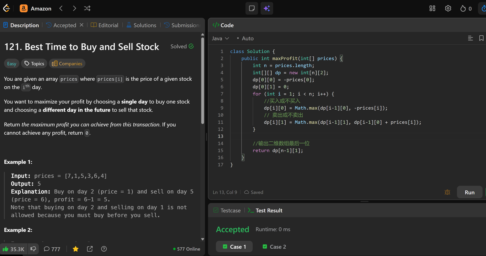

# 121. Best Time to Buy and Sell Stock

**刷题日期**: 2026-02-16

**难度**: Easy

**标签**: Array, Dynamic Programming

## 题目截图



## 解题心得

- 使用二维 DP 数组，`dp[i][0]` 表示第 i 天持有股票的最大利润，`dp[i][1]` 表示第 i 天不持有股票的最大利润
- 买入或不买入：`dp[i][0] = Math.max(dp[i-1][0], -prices[i])`
- 卖出或不卖出：`dp[i][1] = Math.max(dp[i-1][1], dp[i-1][0] + prices[i])`
- 输出二维数组最后一位 `dp[n-1][1]`

## 代码

```java
class Solution {
    public int maxProfit(int[] prices) {
        int n = prices.length;
        int[][] dp = new int[n][2];
        dp[0][0] = -prices[0];
        dp[0][1] = 0;
        for (int i = 1; i < n; i++) {
            //买入或不买入
            dp[i][0] = Math.max(dp[i-1][0], -prices[i]);
            // 卖出或不卖出
            dp[i][1] = Math.max(dp[i-1][1], dp[i-1][0] + prices[i]);
        }
        //输出二维数组最后一位
        return dp[n-1][1];
    }
}
```

## 复杂度分析

- **时间复杂度**: O(n) - 遍历一次价格数组
- **空间复杂度**: O(n) - 使用了 n×2 的二维 DP 数组

---
