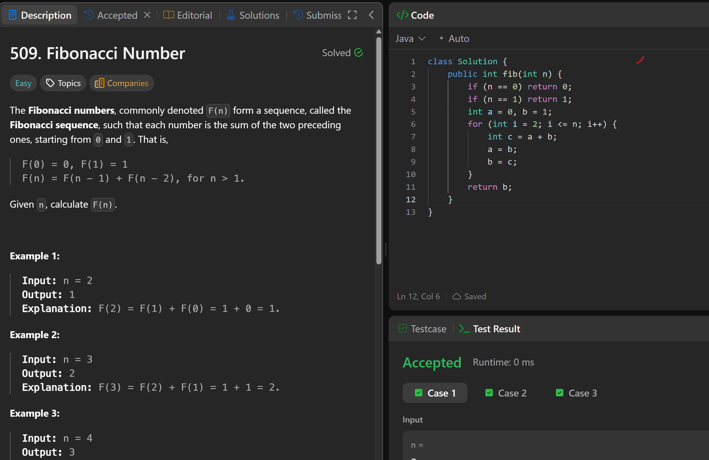

# 509. Fibonacci Number

**刷题日期**: 2025-12-07

**难度**: Easy

**标签**: Math, Dynamic Programming, Recursion, Memoization

## 题目截图



## 解题心得

- 经典斐波那契数列
- F(0) = 0, F(1) = 1
- F(n) = F(n-1) + F(n-2)
- 空间优化：只需要两个变量 a, b

## 代码

```java
class Solution {
    public int fib(int n) {
        if (n == 0) return 0;
        if (n == 1) return 1;
        int a = 0, b = 1;
        for (int i = 2; i <= n; i++) {
            int c = a + b;
            a = b;
            b = c;
        }
        return b;
    }
}
```

## 复杂度分析

- **时间复杂度**: O(n) - 遍历一次
- **空间复杂度**: O(1) - 只使用常数额外空间

---
