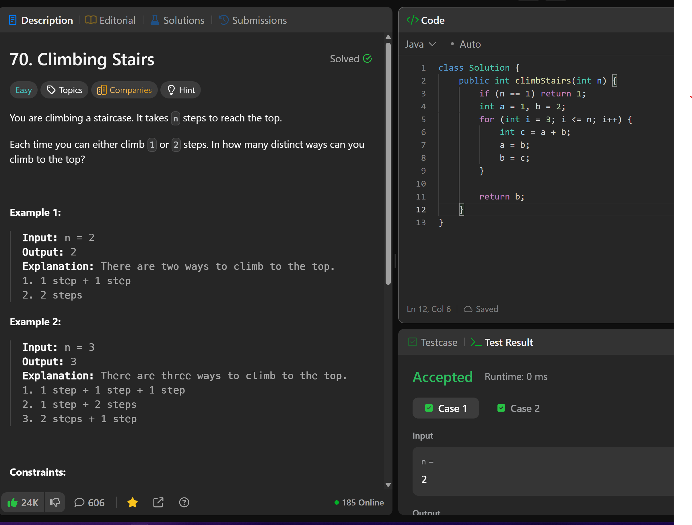

# 70. Climbing Stairs

**刷题日期**: 2025-12-07

**难度**: Easy

**标签**: Math, Dynamic Programming, Memoization

## 题目截图



## 解题心得

- 经典斐波那契数列变形
- `dp[i] = dp[i-1] + dp[i-2]`
- 空间优化：只需要两个变量 a, b

## 代码

```java
class Solution {
    public int climbStairs(int n) {
        if (n == 1) return 1;
        int a = 1, b = 2;
        for (int i = 3; i <= n; i++) {
            int c = a + b;
            a = b;
            b = c;
        }
        return b;
    }
}
```

## 复杂度分析

- **时间复杂度**: O(n) - 遍历一次
- **空间复杂度**: O(1) - 只使用常数额外空间

---
