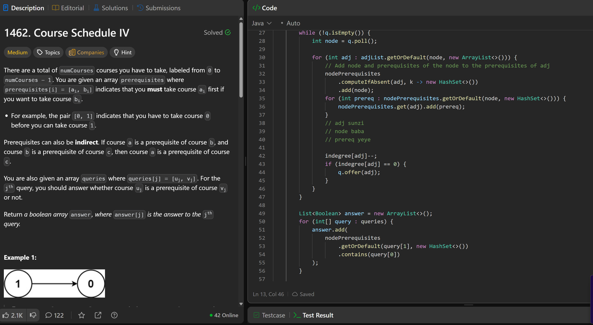
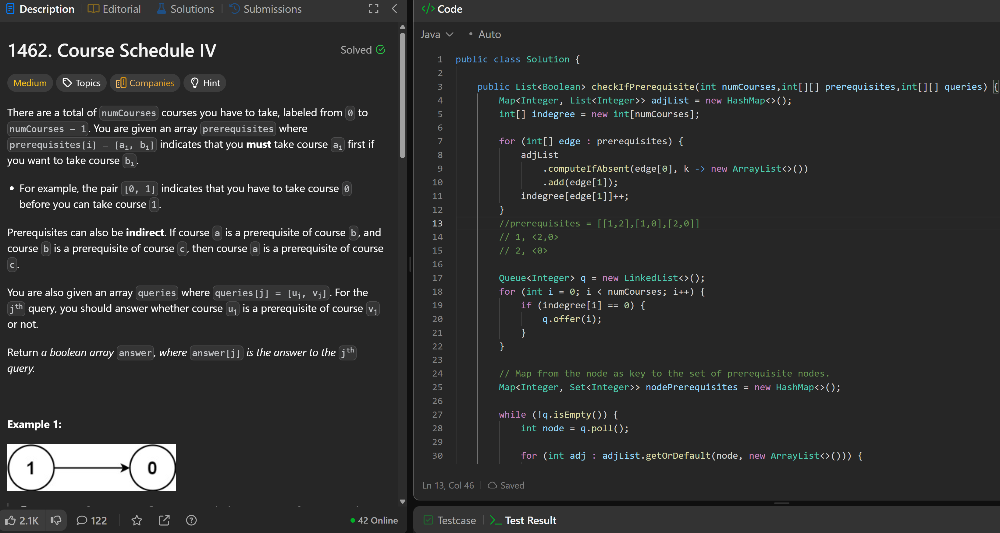

# 1462. Course Schedule IV

**刷题日期**: 2025-12-02

**难度**: Medium

**标签**: Graph, Topological Sort, BFS

## 题目截图




## 解题心得

- 与 207 Course Schedule 类似，使用拓扑排序 (BFS + indegree)
- 关键点：需要记录每个节点的**所有先修课程**（包括间接先修），使用 `Map<Integer, Set<Integer>> nodePrerequisites`
- BFS 遍历时，将当前节点 node 加入到所有邻接节点 adj 的先修集合中，同时把 node 的所有先修也传递给 adj
- 最后遍历 queries，检查 `query[0]` 是否在 `query[1]` 的先修集合中

## 代码

```java
class Solution {
    public List<Boolean> checkIfPrerequisite(int numCourses, int[][] prerequisites, int[][] queries) {
        Map<Integer, List<Integer>> adjList = new HashMap<>();
        int[] indegree = new int[numCourses];

        for (int[] edge : prerequisites) {
            adjList
                .computeIfAbsent(edge[0], k -> new ArrayList<>())
                .add(edge[1]);
            indegree[edge[1]]++;
        }

        Queue<Integer> q = new LinkedList<>();
        for (int i = 0; i < numCourses; i++) {
            if (indegree[i] == 0) {
                q.offer(i);
            }
        }

        // Map from the node as key to the set of prerequisite nodes
        Map<Integer, Set<Integer>> nodePrerequisites = new HashMap<>();

        while (!q.isEmpty()) {
            int node = q.poll();

            for (int adj : adjList.getOrDefault(node, new ArrayList<>())) {
                // Add node and prerequisites of the node to the prerequisites of adj
                nodePrerequisites
                    .computeIfAbsent(adj, k -> new HashSet<>())
                    .add(node);
                for (int prereq : nodePrerequisites.getOrDefault(node, new HashSet<>())) {
                    nodePrerequisites.get(adj).add(prereq);
                }

                indegree[adj]--;
                if (indegree[adj] == 0) {
                    q.offer(adj);
                }
            }
        }

        List<Boolean> answer = new ArrayList<>();
        for (int[] query : queries) {
            answer.add(
                nodePrerequisites
                    .getOrDefault(query[1], new HashSet<>())
                    .contains(query[0])
            );
        }

        return answer;
    }
}
```

## 复杂度分析

- **时间复杂度**: O(V × (V + E) + Q) - V 是课程数，E 是先修关系数，Q 是查询数。每个节点可能传递 O(V) 个先修课程
- **空间复杂度**: O(V² + E) - 最坏情况下每个节点可能有 O(V) 个先修课程

---
