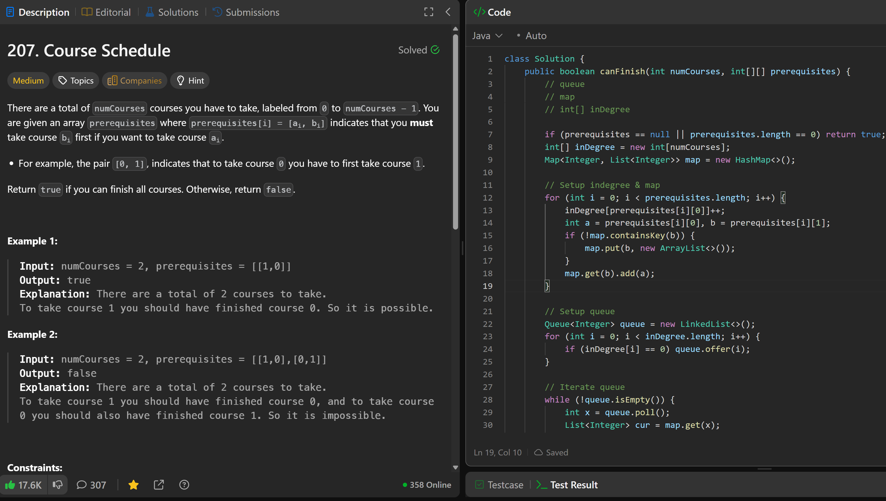

# 207. Course Schedule

**刷题日期**: 2025-11-28

**复习记录**:
- 第 2 次: 2025-12-02
- 第 3 次: 2025-12-04
- 第 4 次: 2025-12-07

**难度**: Medium

**标签**: Graph, Topological Sort, BFS

## 题目截图



## 解题心得

**2025-12-07 复习心得**:
- 需要 queue, map, int[] indegree
- indegree = map init
- go over indegree to check whether we have 0，入度为 0 的先入队
- go queue，遍历队列进行拓扑排序
- important to notice the null：`topList != null && i < topList.size()`
- check indegree int[]，最后检查是否所有入度都为 0

## 代码

```java
class Solution {
    public boolean canFinish(int numCourses, int[][] prerequisites) {
        // queue
        // map
        // int[] inDegree

        if (prerequisites == null || prerequisites.length == 0) return true;
        int[] inDegree = new int[numCourses];
        Map<Integer, List<Integer>> map = new HashMap<>();

        // Setup indegree & map
        for (int i = 0; i < prerequisites.length; i++) {
            inDegree[prerequisites[i][0]]++;
            int a = prerequisites[i][0], b = prerequisites[i][1];
            if (!map.containsKey(b)) {
                map.put(b, new ArrayList<>());
            }
            map.get(b).add(a);
        }

        // Setup queue
        Queue<Integer> queue = new LinkedList<>();
        for (int i = 0; i < inDegree.length; i++) {
            if (inDegree[i] == 0) queue.offer(i);
        }

        // Iterate queue
        while (!queue.isEmpty()) {
            int x = queue.poll();
            List<Integer> cur = map.get(x);
            if (cur == null) continue;
            for (int c : cur) {
                inDegree[c]--;
                if (inDegree[c] == 0) queue.offer(c);
            }
        }

        for (int i : inDegree) {
            if (i != 0) return false;
        }
        return true;
    }
}
```

## 复杂度分析

- **时间复杂度**: O(V + E) - V 是课程数量，E 是先修关系数量
- **空间复杂度**: O(V + E) - 需要存储邻接表和入度数组

---
