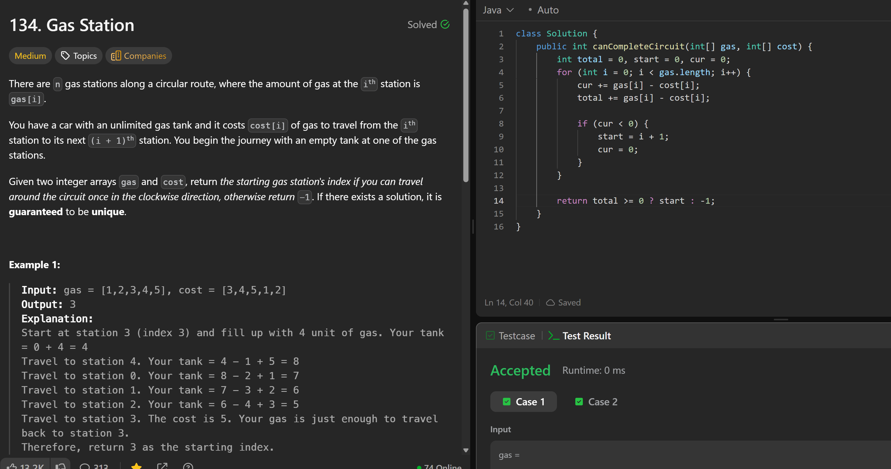

# 134. Gas Station

**刷题日期**: 2025-12-06

**难度**: Medium

**标签**: Array, Greedy

## 题目截图



## 代码

```java
class Solution {
    public int canCompleteCircuit(int[] gas, int[] cost) {
        int total = 0, start = 0, cur = 0;
        for (int i = 0; i < gas.length; i++) {
            cur += gas[i] - cost[i];
            total += gas[i] - cost[i];

            if (cur < 0) {
                start = i + 1;
                cur = 0;
            }
        }

        return total >= 0 ? start : -1;
    }
}
```

## 复杂度分析

- **时间复杂度**: O(n) - 只需遍历一次数组
- **空间复杂度**: O(1) - 只使用了常数个变量

---
