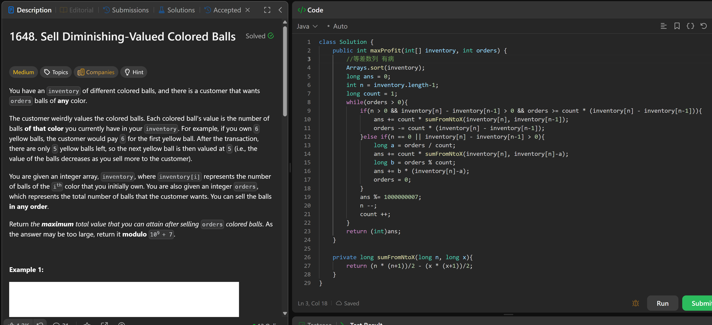

# 1648. Sell Diminishing-Valued Colored Balls

**刷题日期**: 2026-02-23

**难度**: Medium

**标签**: Greedy, Math, Sorting

## 题目截图



## 解题心得

等差数列求和的思路。对 inventory 排序后，从最大值开始贪心地卖球，利用等差数列公式计算每段的收益。

## 代码

```java
class Solution {
    public int maxProfit(int[] inventory, int orders) {
        //等差数列 有高
        Arrays.sort(inventory);
        long ans = 0;
        int n = inventory.length-1;
        long count = 1;
        while(orders > 0){
            if(n > 0 && inventory[n] - inventory[n-1] > 0 && orders >= count * (inventory[n] - inventory[n-1])){
                ans += count * sumFromNtoX(inventory[n], inventory[n-1]);
                orders -= count * (inventory[n] - inventory[n-1]);
            }else if(n == 0 || inventory[n] - inventory[n-1] > 0){
                long a = orders / count;
                long b = orders % count;
                ans += count * sumFromNtoX(inventory[n], inventory[n]-a);
                ans += b * (inventory[n]-a);
                orders = 0;
            }
            ans %= 1000000007;
            n--;
            count++;
        }
        return (int)ans;
    }

    private long sumFromNtoX(long n, long x){
        return (n * (n+1))/2 - (x * (x+1))/2;
    }
}
```

## 复杂度分析

- **时间复杂度**: O(n log n) - 排序需要 O(n log n)，遍历 inventory 数组最多 O(n)
- **空间复杂度**: O(1) - 只使用了常数额外空间（排序可能需要 O(log n) 栈空间）
