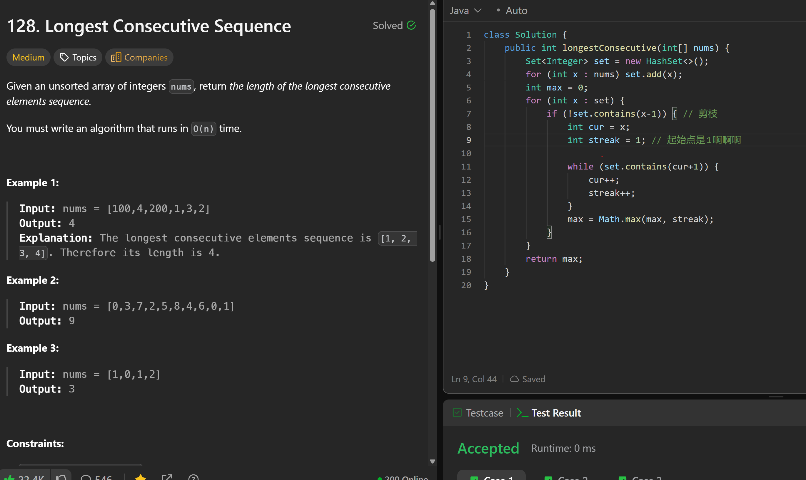

# 128. Longest Consecutive Sequence

**刷题日期**: 2025-12-12

**难度**: Medium

**标签**: Hash Table, Array, Union Find

## 题目截图



## 解题心得

剪枝优化：只从序列的起点开始计数（当 x-1 不在 set 中时），避免重复计算。起始点是1（streak 初始值）。

## 代码

```java
class Solution {
    public int longestConsecutive(int[] nums) {
        Set<Integer> set = new HashSet<>();
        for (int x : nums) set.add(x);
        int max = 0;
        for (int x : set) {
            if (!set.contains(x-1)) { // 剪枝
                int cur = x;
                int streak = 1; // 起始点是1

                while (set.contains(cur+1)) {
                    cur++;
                    streak++;
                }
                max = Math.max(max, streak);
            }
        }
        return max;
    }
}
```

## 复杂度分析

- **时间复杂度**: O(n) - 虽然有嵌套循环，但每个元素最多被访问两次（一次在外层循环，一次在while循环中），因此总时间复杂度是线性的
- **空间复杂度**: O(n) - HashSet 存储所有元素

---
