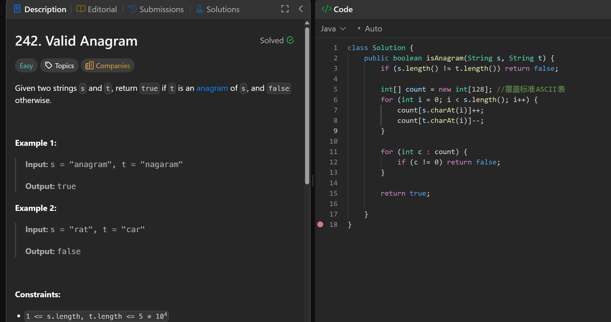
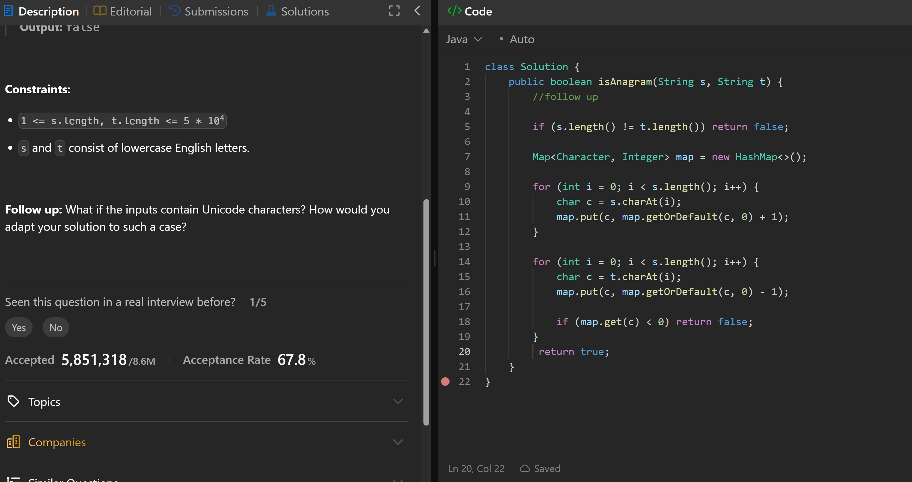

# 242. Valid Anagram

**刷题日期**: 2026-02-21

**难度**: Easy

**标签**: Hash Table, String, Sorting

## 题目截图




## 解题心得

- 解法一：用 int[128] 数组覆盖标准 ASCII 表，s 的字符 ++，t 的字符 --，最后检查是否全为 0
- 解法二（Follow Up）：用 HashMap 处理 Unicode 字符的情况，遍历 s 计数，遍历 t 减计数，如果某个字符计数 < 0 则返回 false

## 代码

### 解法一：数组计数

```java
class Solution {
    public boolean isAnagram(String s, String t) {
        if (s.length() != t.length()) return false;

        int[] count = new int[128]; //覆盖标准ASCII表
        for (int i = 0; i < s.length(); i++) {
            count[s.charAt(i)]++;
            count[t.charAt(i)]--;
        }

        for (int c : count) {
            if (c != 0) return false;
        }
        return true;
    }
}
```

### 解法二：HashMap（Follow Up）

```java
class Solution {
    public boolean isAnagram(String s, String t) {
        //follow up
        if (s.length() != t.length()) return false;

        Map<Character, Integer> map = new HashMap<>();

        for (int i = 0; i < s.length(); i++) {
            char c = s.charAt(i);
            map.put(c, map.getOrDefault(c, 0) + 1);
        }

        for (int i = 0; i < s.length(); i++) {
            char c = t.charAt(i);
            map.put(c, map.getOrDefault(c, 0) - 1);

            if (map.get(c) < 0) return false;
        }
        return true;
    }
}
```

## 复杂度分析

### 解法一
- **时间复杂度**: O(n) - 遍历字符串两次
- **空间复杂度**: O(1) - 固定大小的数组（128）

### 解法二
- **时间复杂度**: O(n) - 遍历字符串两次
- **空间复杂度**: O(n) - HashMap 存储字符计数，适用于 Unicode 字符

---
