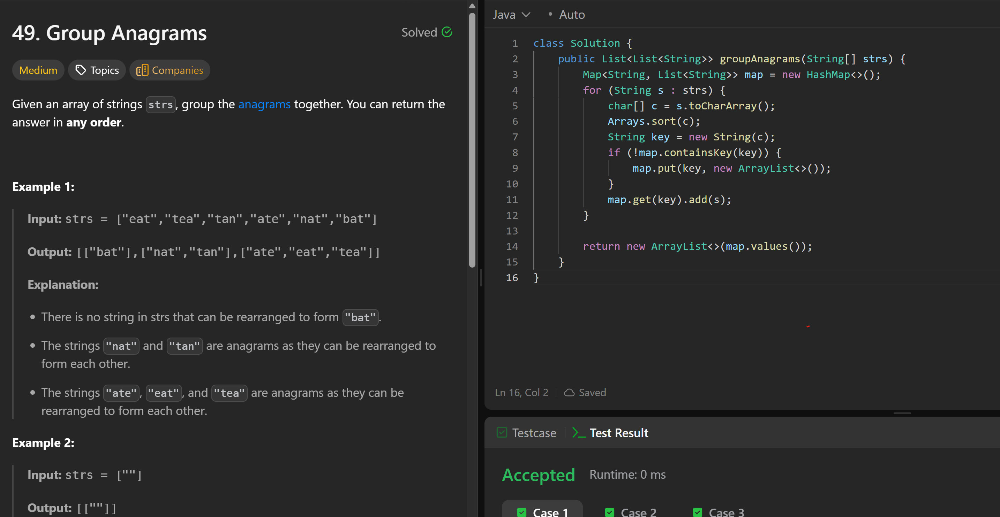

# 49. Group Anagrams

**刷题日期**: 2025-12-07, 2026-02-21

**复习次数**: 2

**难度**: Medium

**标签**: Array, Hash Table, String, Sorting

## 题目截图



## 解题心得

- 将每个字符串排序后作为 key，相同 key 的字符串是 anagram
- 用 HashMap 存储：key 是排序后的字符串，value 是原字符串列表
- 最后返回 map.values()

## 代码

```java
class Solution {
    public List<List<String>> groupAnagrams(String[] strs) {
        Map<String, List<String>> map = new HashMap<>();
        for (String s : strs) {
            char[] c = s.toCharArray();
            Arrays.sort(c);
            String key = new String(c);
            if (!map.containsKey(key)) {
                map.put(key, new ArrayList<>());
            }
            map.get(key).add(s);
        }
        return new ArrayList<>(map.values());
    }
}
```

## 复杂度分析

- **时间复杂度**: O(n * k log k) - n 是字符串数量，k 是最长字符串的长度，排序每个字符串需要 O(k log k)
- **空间复杂度**: O(n * k) - 存储所有字符串

---
