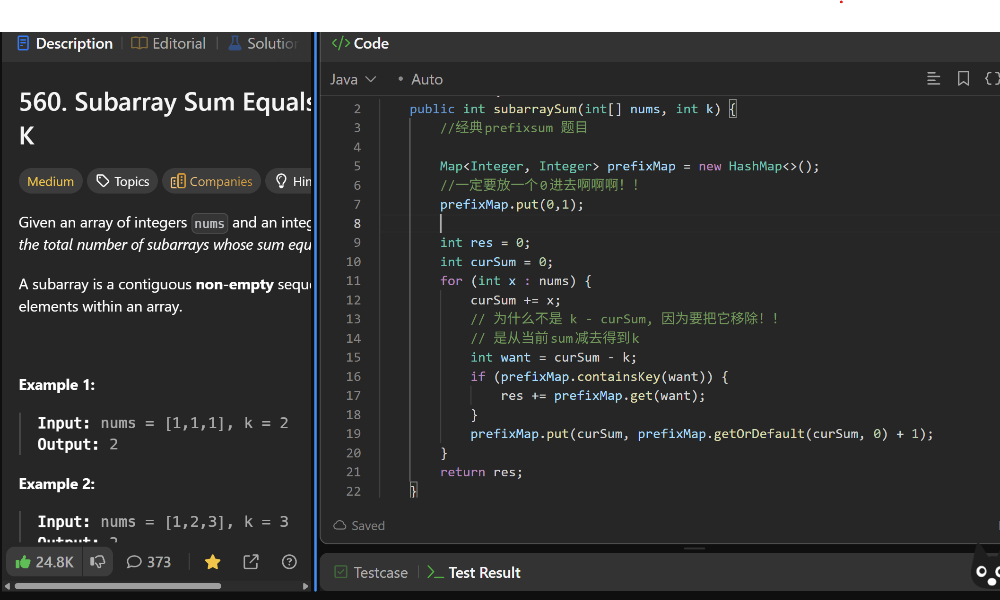

# 560. Subarray Sum Equals K

**刷题日期**: 2026-02-21

**难度**: Medium

**标签**: Array, Hash Table, Prefix Sum

## 题目截图



## 解题心得

- 经典 prefixsum 题目
- 一定要放一个 0 进去（`prefixMap.put(0, 1)`）！！
- `want = curSum - k`，为什么不是 `k - curSum`？因为要把它移除！是从当前 sum 减去得到 k

## 代码

```java
class Solution {
    public int subarraySum(int[] nums, int k) {
        //经典prefixsum 题目
        Map<Integer, Integer> prefixMap = new HashMap<>();
        //一定要放一个0进去啊啊啊！！
        prefixMap.put(0, 1);

        int res = 0;
        int curSum = 0;
        for (int x : nums) {
            curSum += x;
            // 为什么不是 k - curSum，因为要把它移除！！
            // 是从当前sum减去得到k
            int want = curSum - k;
            if (prefixMap.containsKey(want)) {
                res += prefixMap.get(want);
            }
            prefixMap.put(curSum, prefixMap.getOrDefault(curSum, 0) + 1);
        }
        return res;
    }
}
```

## 复杂度分析

- **时间复杂度**: O(n) - 遍历数组一次，HashMap 的 put 和 get 操作均为 O(1)
- **空间复杂度**: O(n) - HashMap 最多存储 n 个不同的前缀和

---
