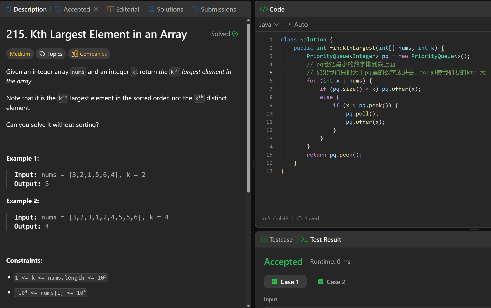

# 215. Kth Largest Element in an Array

**刷题日期**: 2025-12-07, 2026-02-22, 2026-02-23

**复习次数**: 3

**难度**: Medium

**标签**: Array, Divide and Conquer, Sorting, Heap (Priority Queue), Quickselect

## 题目截图



## 解题心得

- pq 会把最小的数字排到最上面（小顶堆）
- 如果我们只把大于 pq 里的数字放进去，top 即使我们要的 kth 大
- 维护一个大小为 k 的小顶堆，堆顶就是第 k 大的元素
- 可以用最大堆，但是 time 是 O(n * k log n)，因为最后取 k 次的时候，每次还要走 O(log n)，走 k 次
- 但是最小堆只用维护 k size，并且 peek 就是答案不需要 for loop 取，所以是 O(n * log k)

## 代码

```java
class Solution {
    public int findKthLargest(int[] nums, int k) {
        PriorityQueue<Integer> pq = new PriorityQueue<>();
        // 可以用最大堆，但是time是O(n * k log n)
        // 因为最后取k次的时候，每次还要走O(log n)，走k次
        // 但是最小堆只用维护k size，并且peek就是答案不需要for loop取，所以是O(n * log k)
        for (int i = 0; i < nums.length; i++) {
            if (pq.size() < k) {
                pq.offer(nums[i]);
            } else {
                if (nums[i] > pq.peek()) {
                    pq.poll();
                    pq.offer(nums[i]);
                }
            }
        }
        return pq.peek();
    }
}
```

## 复杂度分析

- **时间复杂度**: O(n log k) - 遍历数组，每次堆操作是 O(log k)
- **空间复杂度**: O(k) - 堆的大小为 k

---
