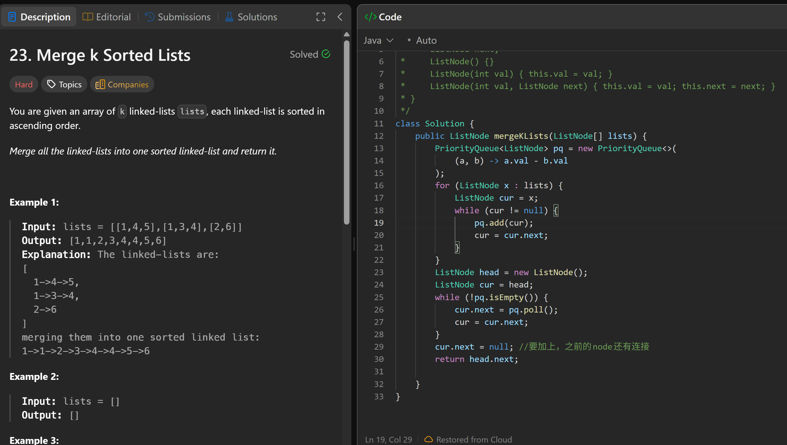

# 23. Merge k Sorted Lists

**刷题日期**: 2026-02-27

**难度**: Hard

**标签**: Linked List, Heap (Priority Queue), Divide and Conquer

## 题目截图



## 解题心得

要加上 `cur.next = null`，之前的 node 还有连接，需要断开。

## 代码

```java
class Solution {
    public ListNode mergeKLists(ListNode[] lists) {
        PriorityQueue<ListNode> pq = new PriorityQueue<>(
            (a, b) -> a.val - b.val
        );
        for (ListNode x : lists) {
            ListNode cur = x;
            while (cur != null) {
                pq.add(cur);
                cur = cur.next;
            }
        }
        ListNode head = new ListNode();
        ListNode cur = head;
        while (!pq.isEmpty()) {
            cur.next = pq.poll();
            cur = cur.next;
        }
        cur.next = null; //要加上，之前的node还有连接
        return head.next;
    }
}
```

## 复杂度分析

- **时间复杂度**: O(N log N) - N 是所有链表节点的总数，每个节点入堆和出堆各一次，每次操作 O(log N)
- **空间复杂度**: O(N) - 优先队列中最多存储 N 个节点
