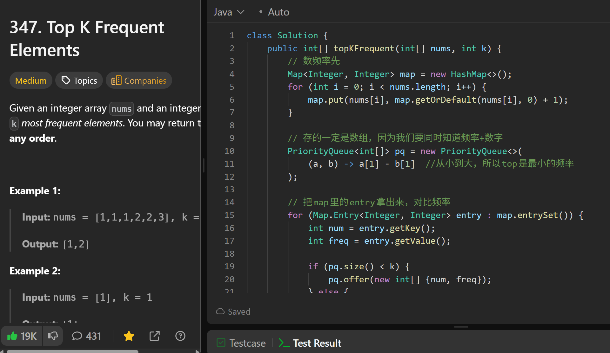

# 347. Top K Frequent Elements

**刷题日期**: 2025-12-05

**难度**: Medium

**标签**: Heap, Hash Table

## 题目截图




## 解题心得

- 数频率先，用 HashMap 存储每个数字的出现次数
- 存的一定是数组，因为我们要同时知道频率+数字
- 使用最小堆（从小到大），所以 top 是最小的频率
- 把 map 里的 entry 拿出来，对比频率，维护大小为 k 的堆
- 最后把 pq 放进答案数组

## 代码

```java
class Solution {
    public int[] topKFrequent(int[] nums, int k) {
        // 数频率先
        Map<Integer, Integer> map = new HashMap<>();
        for (int i = 0; i < nums.length; i++) {
            map.put(nums[i], map.getOrDefault(nums[i], 0) + 1);
        }

        // 存的一定是数组，因为我们要同时知道频率+数字
        PriorityQueue<int[]> pq = new PriorityQueue<>(
            (a, b) -> a[1] - b[1]   //从小到大，所以top是最小的频率
        );

        // 把map里的entry拿出来，对比频率
        for (Map.Entry<Integer, Integer> entry : map.entrySet()) {
            int num = entry.getKey();
            int freq = entry.getValue();

            if (pq.size() < k) {
                pq.offer(new int[] {num, freq});
            } else {
                int[] top = pq.peek();
                if (freq > top[1]) {
                    pq.poll();
                    pq.offer(new int[] {num, freq});
                }
            }
        }

        // 我们要把pq放进答案数组
        int[] res = new int[k];
        int i = 0;
        while(!pq.isEmpty()) {
            int[] top = pq.poll();
            res[i++] = top[0];
        }
        return res;
    }
}
```

## 复杂度分析

- **时间复杂度**: O(n log k) - 遍历数组 O(n)，每次堆操作 O(log k)
- **空间复杂度**: O(n + k) - HashMap 存储 O(n)，堆存储 O(k)

---
