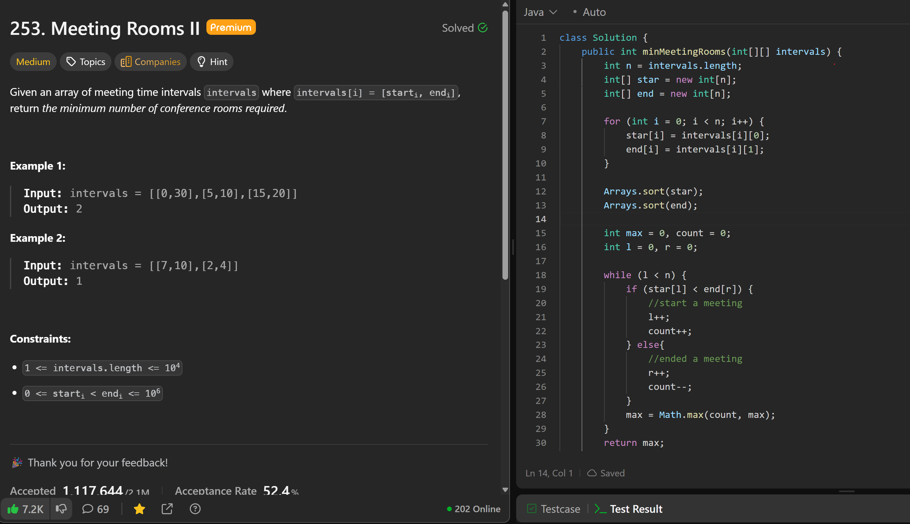

# 253. Meeting Rooms II

**刷题日期**: 2025-12-02

**难度**: Medium

**标签**: Array, Two Pointers, Sorting, Intervals

## 题目截图



## 解题心得

- 将所有会议的开始时间和结束时间分别存入两个数组，然后分别排序
- 使用双指针遍历：当 `start[l] < end[r]` 时，说明有一个新会议开始（还没有会议结束），需要一个新房间
- 当 `start[l] >= end[r]` 时，说明有一个会议结束了，可以释放一个房间
- 用 count 记录当前需要的房间数，max 记录过程中的最大值

## 代码

```java
class Solution {
    public int minMeetingRooms(int[][] intervals) {
        int n = intervals.length;
        int[] star = new int[n];
        int[] end = new int[n];

        for (int i = 0; i < n; i++) {
            star[i] = intervals[i][0];
            end[i] = intervals[i][1];
        }

        Arrays.sort(star);
        Arrays.sort(end);

        int max = 0, count = 0;
        int l = 0, r = 0;

        while (l < n) {
            if (star[l] < end[r]) {
                //start a meeting
                l++;
                count++;
            } else {
                //ended a meeting
                r++;
                count--;
            }
            max = Math.max(count, max);
        }

        return max;
    }
}
```

## 复杂度分析

- **时间复杂度**: O(n log n) - 主要是排序的时间复杂度
- **空间复杂度**: O(n) - 需要两个数组分别存储开始和结束时间

---
