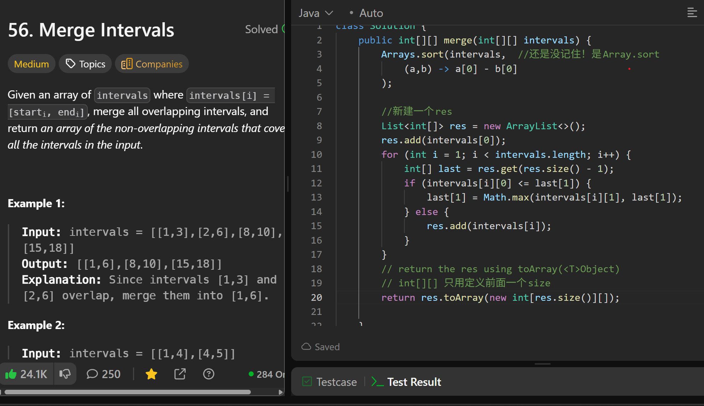

# 56. Merge Intervals

**刷题日期**: 2025-12-05, 2026-02-23

**复习次数**: 2

**难度**: Medium

**标签**: Array, Sorting, Intervals

## 题目截图



## 解题心得

- 还是没记住！是 `Arrays.sort`
- 新建一个 res，先把第一个 interval 加进去
- 遍历时比较当前 interval 的 start 和 res 最后一个的 end
- return the res using `toArray(<T>Object)`
- `int[][]` 只用定义前面一个 size

**复习心得 (2026-02-23)**:
- `Arrays.sort` 要先填个 object，再填 comparator
- 跟合并后的 last 比

## 代码

```java
class Solution {
    public int[][] merge(int[][] intervals) {
        Arrays.sort(intervals,  //还是没记住! 是Array.sort
            (a,b) -> a[0] - b[0]
        );

        //新建一个res
        List<int[]> res = new ArrayList<>();
        res.add(intervals[0]);
        for (int i = 1; i < intervals.length; i++) {
            int[] last = res.get(res.size() - 1);
            if (intervals[i][0] <= last[1]) {
                last[1] = Math.max(intervals[i][1], last[1]);
            } else {
                res.add(intervals[i]);
            }
        }
        // return the res using toArray(<T>Object)
        // int[][] 只用定义前面一个size
        return res.toArray(new int[res.size()][]);
    }
}
```

## 复杂度分析

- **时间复杂度**: O(n log n) - 主要是排序的时间复杂度
- **空间复杂度**: O(n) - 最坏情况下所有区间都不重叠，需要存储所有区间

---
