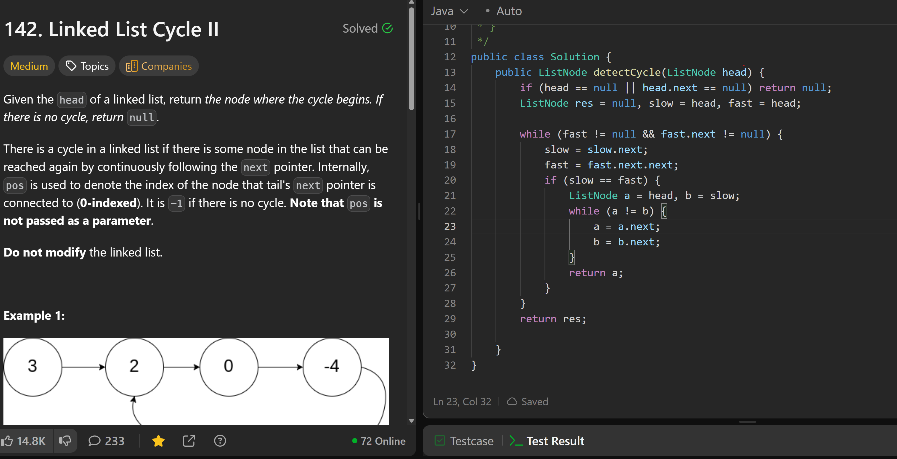

# 142. Linked List Cycle II

**刷题日期**: 2025-11-21

**难度**: Medium

**标签**: Hash Table, Linked List, Two Pointers

## 题目截图



## 代码

```java
public class Solution {
    public ListNode detectCycle(ListNode head) {
        if (head == null || head.next == null) return null;
        ListNode res = null, slow = head, fast = head;

        while (fast != null && fast.next != null) {
            slow = slow.next;
            fast = fast.next.next;
            if (slow == fast) {
                ListNode a = head, b = slow;
                while (a != b) {
                    a = a.next;
                    b = b.next;
                }
                return a;
            }
        }

        return res;
    }
}
```

## 复杂度分析

- **时间复杂度**: O(n) - n 是链表节点数，快慢指针最多遍历链表两次
- **空间复杂度**: O(1) - 只使用了常数个指针变量

---
