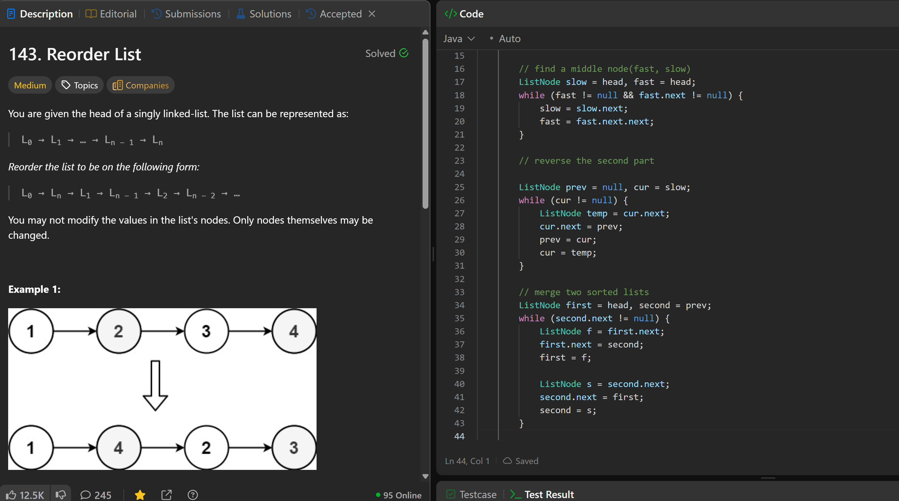

# 143. Reorder List

**刷题日期**: 2026-02-28

**难度**: Medium

**标签**: Linked List, Two Pointers, Stack

## 题目截图



## 解题心得

- 分三步走：找中点 → 反转后半段 → 交替合并
- 用快慢指针找中点
- 反转后半段链表（和 206 题一样的手法）
- 合并时交替插入两个链表的节点

## 代码

```java
class Solution {
    public void reorderList(ListNode head) {
        // find a middle node(fast, slow)
        ListNode slow = head, fast = head;
        while (fast != null && fast.next != null) {
            slow = slow.next;
            fast = fast.next.next;
        }

        // reverse the second part
        ListNode prev = null, cur = slow;
        while (cur != null) {
            ListNode temp = cur.next;
            cur.next = prev;
            prev = cur;
            cur = temp;
        }

        // merge two sorted lists
        ListNode first = head, second = prev;
        while (second.next != null) {
            ListNode f = first.next;
            first.next = second;
            first = f;

            ListNode s = second.next;
            second.next = first;
            second = s;
        }
    }
}
```

## 复杂度分析

- **时间复杂度**: O(n) - 找中点 O(n) + 反转 O(n) + 合并 O(n)
- **空间复杂度**: O(1) - 只使用了常数个指针变量

---
