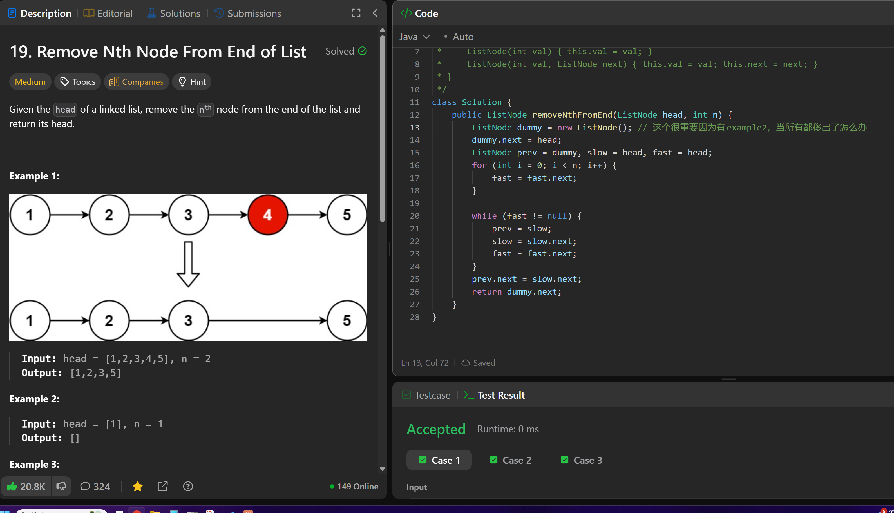

# 19. Remove Nth Node From End of List

**刷题日期**: 2025-12-06

**难度**: Medium

**标签**: Linked List, Two Pointers

## 题目截图



## 解题心得

- 这个很重要因为有 example2，当所有都移出了怎么办 - 用 dummy 节点解决

## 代码

```java
class Solution {
    public ListNode removeNthFromEnd(ListNode head, int n) {
        ListNode dummy = new ListNode(); // 这个很重要因为有example2, 当所有都移出了怎么办
        dummy.next = head;
        ListNode prev = dummy, slow = head, fast = head;
        for (int i = 0; i < n; i++) {
            fast = fast.next;
        }

        while (fast != null) {
            prev = slow;
            slow = slow.next;
            fast = fast.next;
        }
        prev.next = slow.next;
        return dummy.next;
    }
}
```

## 复杂度分析

- **时间复杂度**: O(n) - n 是链表的长度，只需遍历一次
- **空间复杂度**: O(1) - 只使用了常数个指针变量

---
