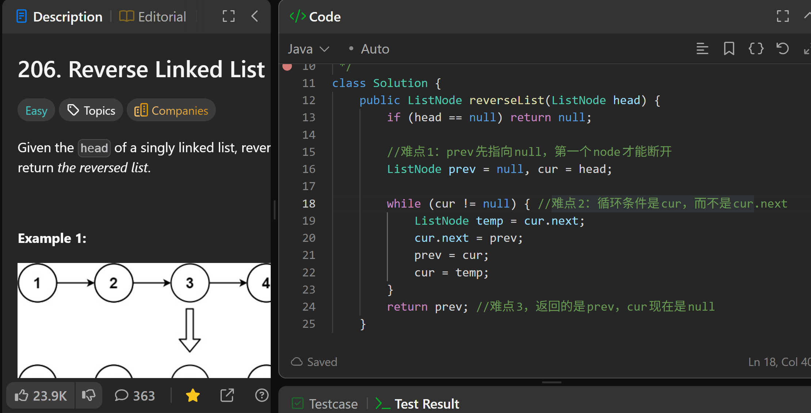

# 206. Reverse Linked List

**刷题日期**: 2025-11-21

**难度**: Easy

**标签**: Linked List, Recursion

## 题目截图



## 解题心得

- 难点1: prev 先指向 null，第一个 node 才能断开
- 难点2: 循环条件是 cur，而不是 cur.next
- 难点3: 返回的是 prev，cur 现在是 null

## 代码

```java
class Solution {
    public ListNode reverseList(ListNode head) {
        if (head == null) return null;

        //难点1: prev先指向null，第一个node才能断开
        ListNode prev = null, cur = head;

        while (cur != null) { //难点2: 循环条件是cur，而不是cur.next
            ListNode temp = cur.next;
            cur.next = prev;
            prev = cur;
            cur = temp;
        }
        return prev; //难点3, 返回的是prev，cur现在是null
    }
}
```

## 复杂度分析

- **时间复杂度**: O(n) - n 是链表的长度，遍历一次链表
- **空间复杂度**: O(1) - 只使用了常数个指针变量

---
