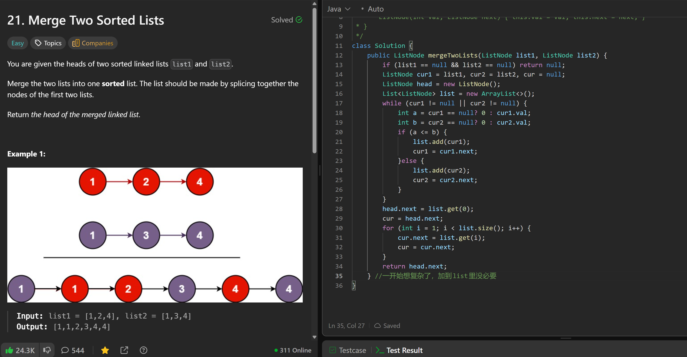
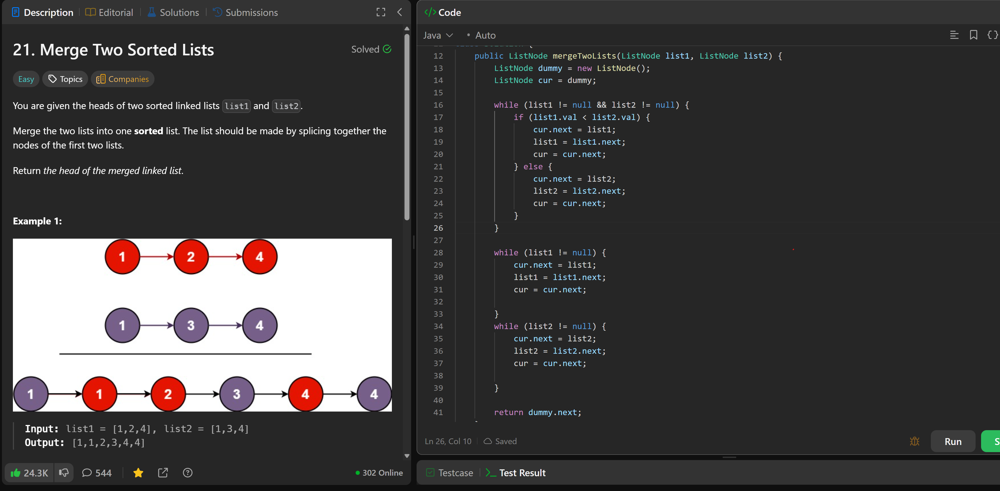

# 21. Merge Two Sorted Lists

**刷题日期**: 2025-11-23, 2025-12-06

**复习次数**: 2

**难度**: Easy

**标签**: Linked List

## 题目截图





## 解题心得

一开始想复杂了，用 ArrayList 存储节点后再连接，其实没必要。直接用 dummy 节点，边比较边连接即可。

## 代码

```java
class Solution {
    public ListNode mergeTwoLists(ListNode list1, ListNode list2) {
        ListNode dummy = new ListNode();
        ListNode cur = dummy;

        while (list1 != null && list2 != null) {
            if (list1.val < list2.val) {
                cur.next = list1;
                list1 = list1.next;
                cur = cur.next;
            } else {
                cur.next = list2;
                list2 = list2.next;
                cur = cur.next;
            }
        }

        while (list1 != null) {
            cur.next = list1;
            list1 = list1.next;
            cur = cur.next;
        }

        while (list2 != null) {
            cur.next = list2;
            list2 = list2.next;
            cur = cur.next;
        }

        return dummy.next;
    }
}
```

## 复杂度分析

- **时间复杂度**: O(n + m) - n 和 m 分别是两个链表的长度
- **空间复杂度**: O(1) - 只使用了常数个指针变量

---
