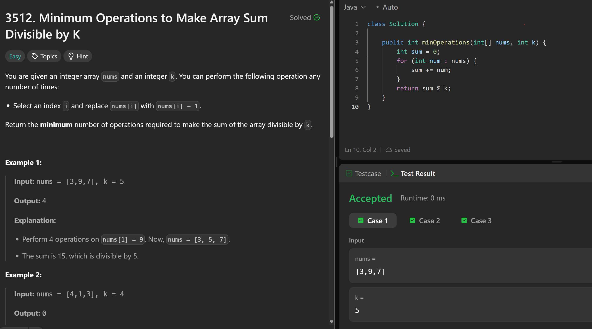

# 3512. Minimum Operations to Make Array Sum Divisible by K

**刷题日期**: 2025-11-28

**难度**: Easy

**标签**: Math, Array

## 题目截图



## 代码

```java
class Solution {
    public int minOperations(int[] nums, int k) {
        int sum = 0;
        for (int num : nums) {
            sum += num;
        }
        return sum % k;
    }
}
```

## 复杂度分析

- **时间复杂度**: O(n) - 需要遍历数组一次计算总和
- **空间复杂度**: O(1) - 只使用了常数额外空间

---
