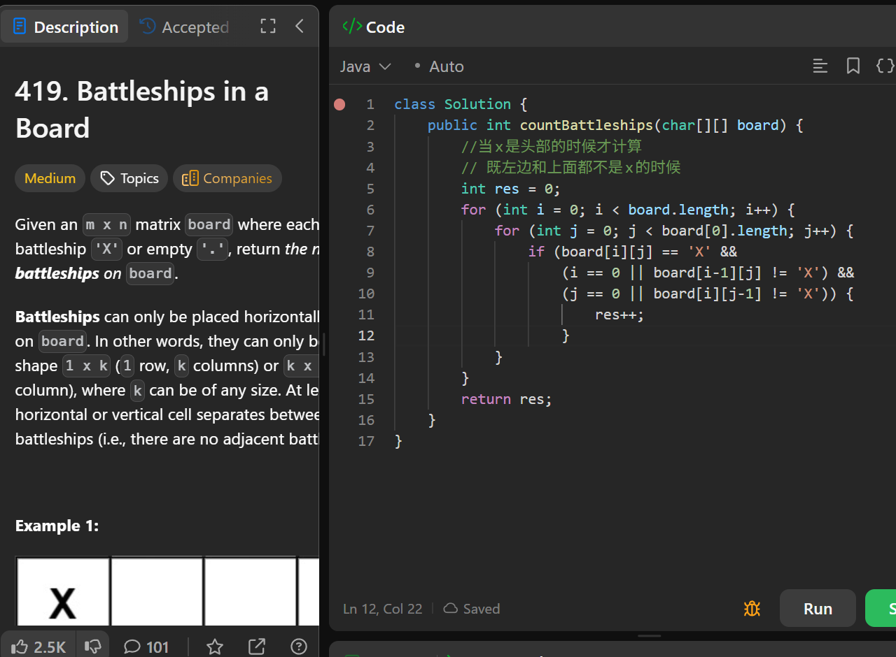

# 419. Battleships in a Board

**刷题日期**: 2026-02-28

**难度**: Medium

**标签**: Matrix, Array

## 题目截图



## 解题心得

- 当 x 是头部的时候才计算
- 既左边和上面都不是 x 的时候，说明是一个新的 battleship 的头部
- 只需要一次遍历，不需要额外空间

## 代码

```java
class Solution {
    public int countBattleships(char[][] board) {
        //当x是头部的时候才计算
        // 既左边和上面都不是x的时候
        int res = 0;
        for (int i = 0; i < board.length; i++) {
            for (int j = 0; j < board[0].length; j++) {
                if (board[i][j] == 'X' &&
                    (i == 0 || board[i-1][j] != 'X') &&
                    (j == 0 || board[i][j-1] != 'X')) {
                        res++;
                    }
            }
        }
        return res;
    }
}
```

## 复杂度分析

- **时间复杂度**: O(m * n) - 遍历整个矩阵
- **空间复杂度**: O(1) - 只使用了常数个变量

---
