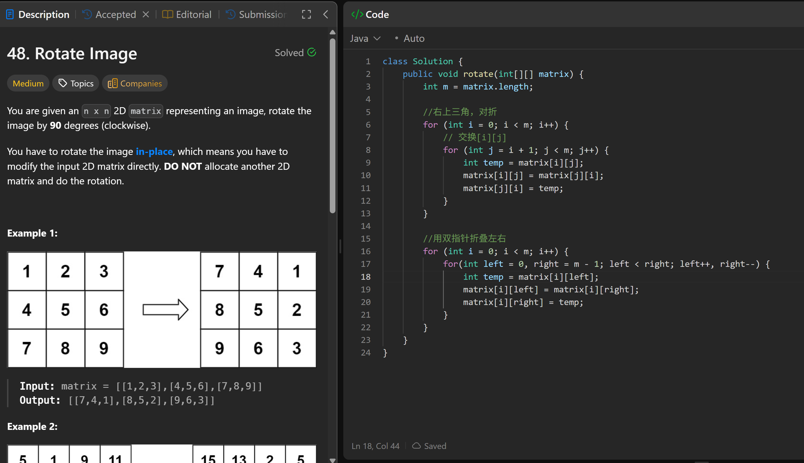

# 48. Rotate Image

**刷题日期**: 2026-02-27

**难度**: Medium

**标签**: Array, Math, Matrix

## 题目截图



## 解题心得

两步走：
1. 右上三角对折（转置）：交换 `matrix[i][j]` 和 `matrix[j][i]`
2. 用双指针折叠左右：每行左右对称交换

## 代码

```java
class Solution {
    public void rotate(int[][] matrix) {
        int m = matrix.length;

        //右上三角，对折
        for (int i = 0; i < m; i++) {
            // 交换[i][j]
            for (int j = i + 1; j < m; j++) {
                int temp = matrix[i][j];
                matrix[i][j] = matrix[j][i];
                matrix[j][i] = temp;
            }
        }

        //用双指针折叠左右
        for (int i = 0; i < m; i++) {
            for (int left = 0, right = m - 1; left < right; left++, right--) {
                int temp = matrix[i][left];
                matrix[i][left] = matrix[i][right];
                matrix[i][right] = temp;
            }
        }
    }
}
```

## 复杂度分析

- **时间复杂度**: O(n²) - n 是矩阵的边长，需要遍历矩阵中的每个元素
- **空间复杂度**: O(1) - 原地修改，只使用常数额外空间
