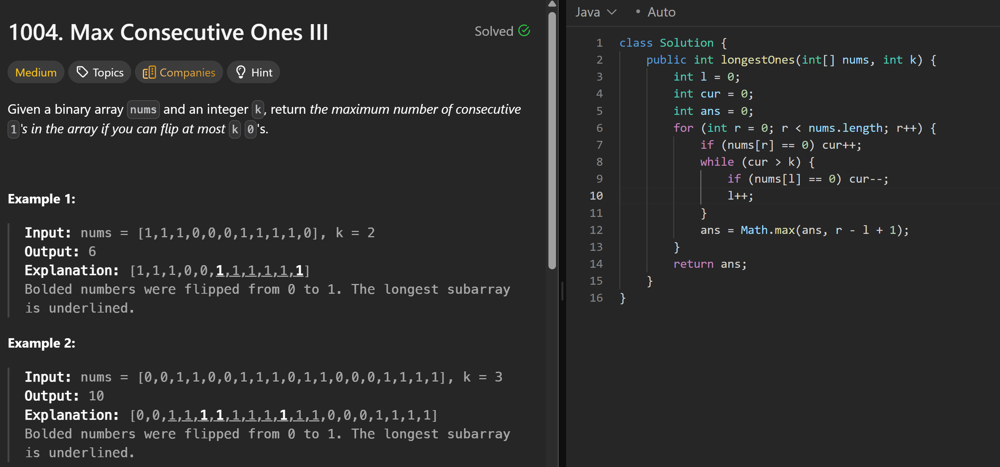

# 1004. Max Consecutive Ones III

**刷题日期**: 2026-02-22

**难度**: Medium

**标签**: Array, Binary Search, Sliding Window, Prefix Sum

## 题目截图



## 代码

```java
class Solution {
    public int longestOnes(int[] nums, int k) {
        int l = 0;
        int cur = 0;
        int ans = 0;
        for (int r = 0; r < nums.length; r++) {
            if (nums[r] == 0) cur++;
            while (cur > k) {
                if (nums[l] == 0) cur--;
                l++;
            }
            ans = Math.max(ans, r - l + 1);
        }
        return ans;
    }
}
```

## 复杂度分析

- **时间复杂度**: O(n) - 左右指针各遍历数组一次
- **空间复杂度**: O(1) - 只使用了常数个变量

---
