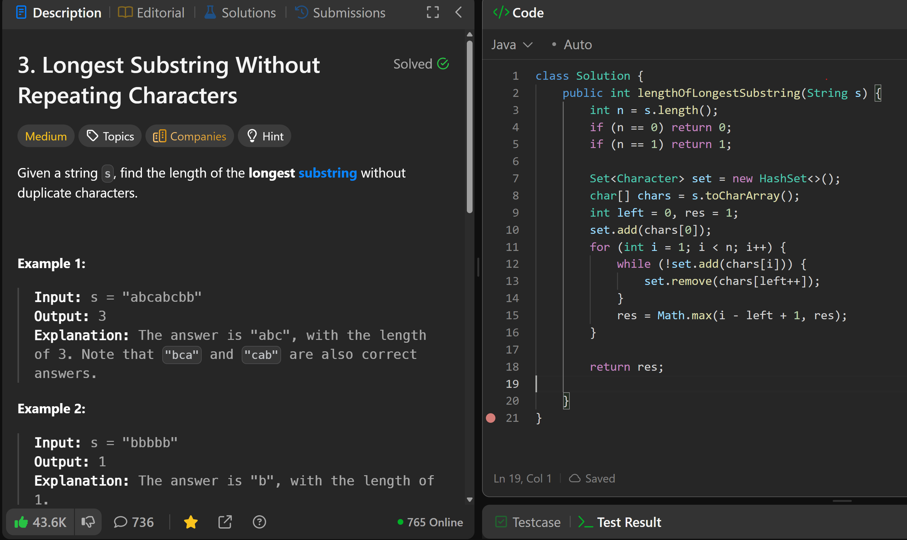

# 3. Longest Substring Without Repeating Characters

**刷题日期**: 2025-11-21

**难度**: Medium

**标签**: Hash Table, String, Sliding Window

## 题目截图



## 代码

```java
class Solution {
    public int lengthOfLongestSubstring(String s) {
        int n = s.length();
        if (n == 0) return 0;
        if (n == 1) return 1;

        Set<Character> set = new HashSet<>();
        char[] chars = s.toCharArray();
        int left = 0, res = 1;
        set.add(chars[0]);
        for (int i = 1; i < n; i++) {
            while (!set.add(chars[i])) {
                set.remove(chars[left++]);
            }
            res = Math.max(i - left + 1, res);
        }

        return res;
    }
}
```

## 复杂度分析

- **时间复杂度**: O(n) - 每个字符最多被访问两次（一次被右指针添加，一次被左指针移除）
- **空间复杂度**: O(min(n, m)) - n 是字符串长度，m 是字符集大小。HashSet 最多存储 min(n, m) 个字符

---
